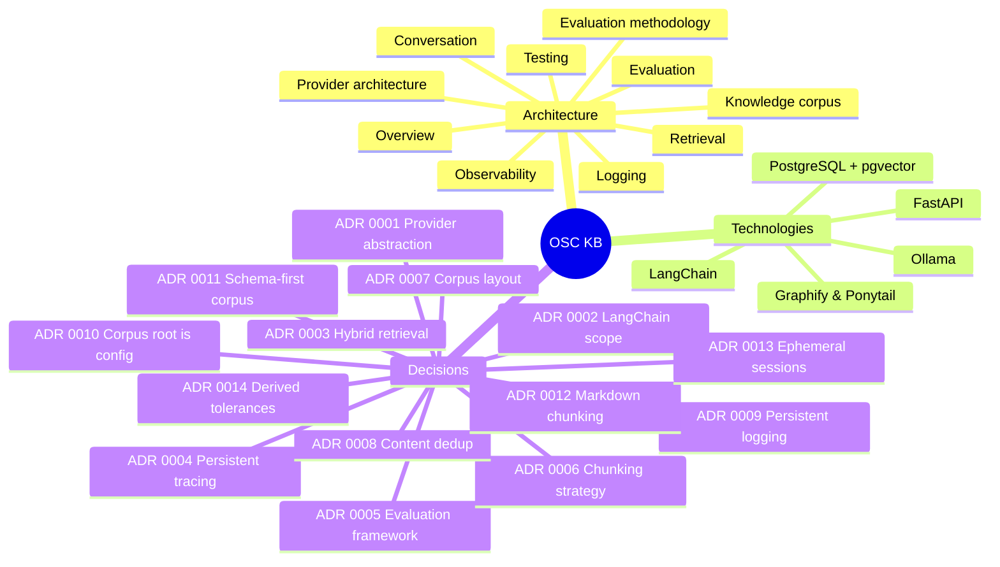

# OSC Engineering Knowledge Base

This is the internal textbook for OSC's knowledge assistant. It exists because
`PROJECT_STATUS.md` answers *what the system is today* and the code answers *what it
does*, and neither answers **why it is built this way** — which is the question that
actually costs time when a new engineer, or a new AI session, picks the project up.

> **This directory is not part of the answer corpus.** The ingest root is
> `corpus.root` — `docs/company/schema/` by default (see
> [`architecture/knowledge-corpus.md`](architecture/knowledge-corpus.md)).
> Nothing written here is retrievable by the assistant, which is deliberate: an
> employee asking "how do I set up tiered pricing?" must not be answered with our
> tracing design.

---

## How to read it

**If you are new**, read in this order:

1. [`architecture/overview.md`](architecture/overview.md) — the whole system on one page.
2. [`architecture/provider-architecture.md`](architecture/provider-architecture.md) — the
   five seams everything else is built on.
3. [`architecture/retrieval.md`](architecture/retrieval.md) — how a question becomes
   passages.
4. [`architecture/observability.md`](architecture/observability.md) — how to find out
   what happened during one request, and
   [`architecture/logging.md`](architecture/logging.md) — how to find out what
   happened at all.
5. [`architecture/conversation.md`](architecture/conversation.md) — how a follow-up
   resolves against what was said before, and what is deliberately not remembered.
6. [`architecture/evaluation.md`](architecture/evaluation.md) — how we know whether a
   change helped.

**If you are about to change retrieval**, read `architecture/evaluation.md` first.
The project's rule is that a retrieval change ships with a measured improvement, and
`make eval` is what makes that enforceable rather than aspirational.

**If you are about to add a dependency or an abstraction**, read the relevant ADR in
[`decisions/`](decisions/). Several things that look missing were considered and
rejected, with reasons.

---

## Contents

### Architecture

| Document | What it answers |
|---|---|
| [overview.md](architecture/overview.md) | What the system is, how a request flows, what the module boundaries are and why |
| [provider-architecture.md](architecture/provider-architecture.md) | How 37 providers are swappable by configuration with no business-logic change |
| [retrieval.md](architecture/retrieval.md) | Hybrid search, RRF, reranking, the six retrieval stages |
| [chunking-and-embeddings.md](architecture/chunking-and-embeddings.md) | Why chunk size is the highest-leverage knob, and what an embedding actually is |
| [observability.md](architecture/observability.md) | Tracing, persistent traces, the debugging workflow |
| [logging.md](architecture/logging.md) | Persistent logs, rotation, retention, the audit stream, redaction |
| [conversation.md](architecture/conversation.md) | Sessions, ephemeral memory, isolation, and where history does and does not reach |
| [evaluation.md](architecture/evaluation.md) | The suites, how to run a comparison, how to gate CI |
| [evaluation-methodology.md](architecture/evaluation-methodology.md) | Every metric's definition, purpose, limitations, baseline and regression criteria |
| [knowledge-corpus.md](architecture/knowledge-corpus.md) | How the corpus is organised and how to grow it |
| [testing.md](architecture/testing.md) | The four test tiers and what each is for |

### Technologies

Each page answers the same seven questions: what it is, why OSC uses it, where it is
used, how it integrates, what else was considered, the trade-offs accepted, and how it
is expected to evolve.

| Document | Covers |
|---|---|
| [postgresql-pgvector.md](technologies/postgresql-pgvector.md) | The datastore, vector indexing, full-text search, HNSW |
| [ollama.md](technologies/ollama.md) | The local model runtime, Qwen3, nomic-embed-text |
| [langchain.md](technologies/langchain.md) | What was adopted, what was refused, and the rule that decided |
| [fastapi.md](technologies/fastapi.md) | The HTTP layer, SSE streaming, Pydantic at the boundary |
| [python-tooling.md](technologies/python-tooling.md) | Typer, Rich, Pydantic, ruff, mypy --strict, pytest |
| [graphify-and-ponytail.md](technologies/graphify-and-ponytail.md) | The two development-time tools and how to use them |

### Decisions

Architecture Decision Records. Format: context, decision, alternatives, consequences.
See [decisions/README.md](decisions/README.md).

---

## Keeping this accurate

Documentation that has drifted is worse than none, because it is trusted. Three rules:

1. **A change to a subsystem updates that subsystem's page in the same commit.** Not
   the next one.
2. **A significant decision gets an ADR, and ADRs are append-only.** Superseding an
   ADR means writing a new one that says so, never editing the old one — the reason a
   past decision was right at the time is itself information.
3. **Numbers carry their source.** Any performance or quality figure in this
   directory names the run it came from, or it does not belong here. `PROJECT_STATUS.md`
   is the report; this is the reasoning.
