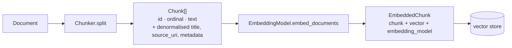

# Chunking and Embeddings

*What happens to a document between the filesystem and the index — and why chunk size
is the highest-leverage knob in the system.*

---

## Why documents are split at all

Two hard constraints and one soft one.

**Embedding models have a fixed input window**, typically 512–8192 tokens. A 600-line
FAQ does not fit.

**A single vector for a whole document is a vector for nothing in particular.**
Averaging seventeen unrelated topics into 768 numbers produces a point that is
moderately close to every query and near to none — the retrieval equivalent of a
photograph of everyone in a building.

**The prompt budget is finite.** Qwen3 on this deployment has a 4096-token window.
Five chunks of ~900 characters plus a system prompt is what fits. Retrieval must return
*passages*, not documents, or the context is spent before the answer starts.

---

## The pipeline



`Chunk` denormalises `title` and `source_uri` from its parent document. That is a
deliberate redundancy: a retrieval hit is then **self-describing**, so the generation
layer can cite it without a second lookup, and a non-SQL vector store need not support
joins.

`EmbeddedChunk` carries the `embedding_model` id alongside the vector, so a store can
refuse to compare vectors produced by different models rather than silently returning
nonsense similarity scores.

---

## Chunk ids and idempotent ingestion

Chunk ids come from one shared helper that every chunker uses, so ingestion behaves
identically whichever strategy is configured. The id is derived from document id,
ordinal and content.

The consequence that will bite you: **changing the chunker invalidates every stored
chunk while every document content hash still matches.** Ingestion sees unchanged
documents, skips them, and leaves a stale index that looks healthy. Use:

```bash
./osc ingest ./docs/company --reindex
```

This is called out in `PROJECT_STATUS.md`, in `config/default.yaml`, and here, because
it has caught people.

---

## The four strategies

| Name | Source | What it does |
|---|---|---|
| `recursive` | OSC | Splits on the coarsest separator that fits: paragraphs, then lines, then sentences, then characters. **The default** |
| `fixed` | OSC | Fixed-size windows. An evaluation baseline, deliberately naive |
| `langchain_recursive` | `langchain-text-splitters` | The same idea, better edge cases |
| `markdown` | `langchain-text-splitters` | Splits on heading structure *first*, packs to size second, records the heading path on each chunk's metadata |

### Why the default is still `recursive` despite known defects

The built-in `recursive` chunker has two known rough edges, both documented: a chunk
can exceed its size budget by up to the overlap, and the overlap slice can cut
mid-word. `langchain_recursive` does not have either.

It remains the default because **switching it changes every chunk boundary and
therefore every chunk id in a live index**, and the project's rule is that a retrieval
change ships with a measured improvement. Until this iteration there was no way to
measure one.

There is now. The comparison — `recursive` vs `langchain_recursive` vs `markdown`, with
a number and a decision — is the top recommended next milestone, and it is two commands:

```bash
./osc eval --retrieval-only -o evaluation/results/recursive.json
# edit a profile to set chunking.strategy, then:
./osc ingest ./docs/company --reindex --profile config/experiments/markdown.yaml
./osc eval --retrieval-only --profile config/experiments/markdown.yaml \
  --baseline evaluation/results/recursive.json
```

### Why `markdown` is the interesting candidate

The corpus is now 17 topic-scoped Markdown files whose H2 headings are the questions
users ask. A splitter that respects that structure keeps a question and its answer in
one chunk, and records the heading path — so a chunk knows it is under
*Draft Order → How are Shopify discount coupons applied?* rather than being an
anonymous 900-character window that happens to straddle two questions.

That is a hypothesis, not a result. It is exactly the kind of claim that used to get
adopted on plausibility and now has to earn a number.

---

## Chunk size: the highest-leverage knob

```yaml
chunking:
  strategy: recursive
  chunk_size: 900        # characters
  chunk_overlap: 120
```

**Too small** and a chunk loses the context that makes it interpretable — "Yes, this is
supported." is a perfect retrieval hit and a useless passage.

**Too large** and each chunk covers several topics, so its embedding is diluted toward
the same everything-and-nothing point a whole-document vector occupies; and fewer
chunks fit the prompt budget.

**Overlap** exists so a fact that straddles a boundary survives in at least one chunk
whole. It costs storage and duplicate retrieval hits.

900/120 is sized against the answer model's 4096-token context: roughly 225 tokens per
chunk, five chunks of sources, leaving room for the system prompt and the answer. It is
an educated guess. `./osc status` reports the *observed* chunk-length percentiles,
which is the only honest way to check the configured target is being met — a
`chunk_size` of 900 with a p95 of 180 means the separators are firing far too early.

Current index: 21 documents, 193 chunks, median 826 characters. Close to target.

---

## What an embedding is, and why the model choice is separate

An embedding model maps text to a fixed-length vector such that texts with similar
meaning land near each other under cosine similarity. Retrieval is then a
nearest-neighbour search: embed the query, find the closest chunk vectors.

The default is `nomic-embed-text` via Ollama, 768 dimensions.

**It is chosen independently of the chat model, and that separation is a requirement,
not a coincidence.** They are different jobs: an embedding model is a retrieval
instrument, a chat model is a writer. The best available embedder is rarely made by the
same vendor as the best available generator, and coupling them would mean a chat model
upgrade forcing a full re-index.

`nomic-embed-text` specifically: purpose-built for retrieval, runs locally so no corpus
text leaves the host, and 768 dimensions sits comfortably inside pgvector's 2000-
dimension HNSW limit.

### The dimension constraint

The vector width is fixed in the DDL at migration time. **Changing the embedding model
requires a new database and a full re-index.** The store refuses to start on a mismatch
(`DimensionMismatchError`) rather than comparing incompatible vectors — failing loudly
at startup is preferable to silently returning nonsense similarity scores.

Above 2000 dimensions pgvector cannot build an HNSW index and search degrades to an
exact scan. The migration creates the index conditionally and reports which it did.

---

## Parsing, and the rule parsers obey

`ingestion/parsers.py` maps a file extension to an extraction function. Nine
extensions, one function each, one dict — not a registry, because a parser is selected
by extension and takes no options, so `PARSERS: dict[str, Parser]` is the whole
mechanism.

| Extension | Via |
|---|---|
| `.md` `.markdown` `.txt` `.rst` | read directly |
| `.html` `.htm` | stdlib `html.parser`, dropping script and style |
| `.pdf` | `pypdf`, per page, retaining `page_count` |
| `.docx` | `python-docx`, including table cells |
| `.xlsx` | `openpyxl` read-only, one block per sheet, cells tab-joined per row |

**Parsers extract and never rewrite.** Chunk text is quoted back as citation evidence,
so invented or normalised text would make that evidence a forgery. PDF trailing-space
padding is stripped because it is a layout artefact with no meaning; no word is ever
altered.

Two formats fail loudly rather than indexing nothing: a scanned PDF (no extractable
text — almost certainly needs OCR, which is not in the pipeline) and an empty workbook.
Silently indexing an empty document would make it permanently unfindable *and* hide the
real problem.

**A file that cannot be parsed is recorded in `failures` and skipped**, and the
ingestion pipeline treats it as *present but unreadable* rather than deleted — so a
transient parse failure cannot prune a healthy document out of the index.

---

## Related

- [retrieval.md](retrieval.md) — what happens to these chunks at query time
- [knowledge-corpus.md](knowledge-corpus.md) — what goes in
- [ADR 0006](../decisions/0006-chunking-strategy.md) — the decision record
