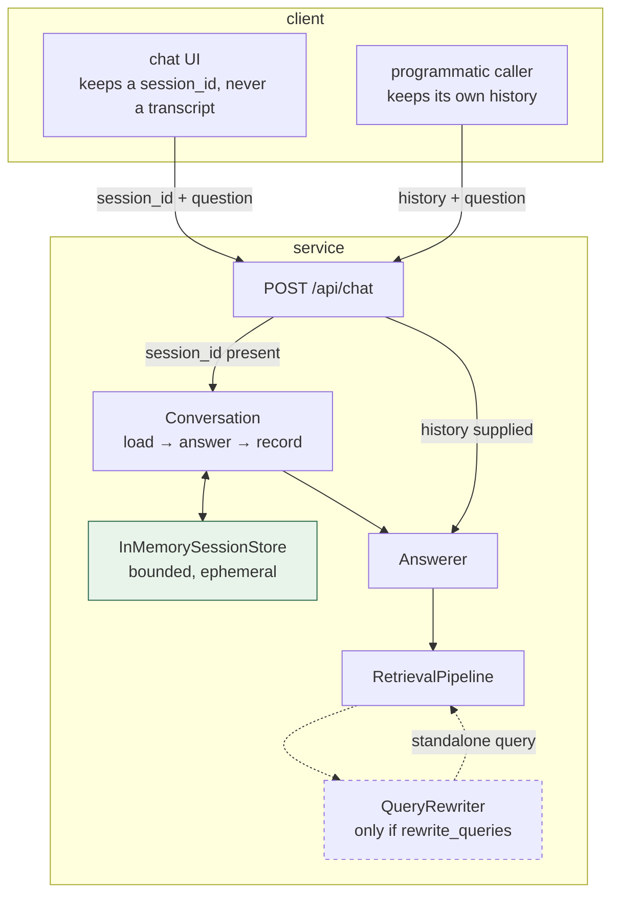

# Conversation and session memory

How OSC turns a sequence of independent questions into a conversation, what it
remembers, for how long, and what it deliberately does not remember.

Design rationale is in [ADR 0013](../decisions/0013-ephemeral-session-memory.md); this
page is how it works and how to operate it.

---

## Why this exists

Through Phase 5 every question was independent. The API accepted a `history` array and
the caller was responsible for keeping it, which made *"does OSC handle follow-ups?"* a
question about the **caller** rather than about OSC — and the bundled UI sent no
history at all, so it did not.

The pieces were already there and unused. `Answerer.answer()` and `Answerer.stream()`
both take `history`, and `QueryRewriter` exists specifically to resolve conversational
references into a standalone retrieval query. What was missing was somewhere for the
conversation to live between turns.

---

## The shape



Two ways to supply context, and they are **mutually exclusive on one request**:

| | `session_id` | `history` |
|---|---|---|
| Who holds the transcript | the server | the caller |
| What goes on the wire per turn | one question | the whole conversation |
| Survives a service restart | no | yes |
| Right for | a chat UI | a stateless integration |

Supplying both is a `422`. Accepting both would mean silently choosing which to
believe.

---

## Three pieces

`src/osc_assistant/conversation.py`, in dependency order.

### `SessionStore` — the seam

A `Protocol` with four methods: `create`, `history`, `record`, `destroy`. Async,
because the implementation that eventually replaces the in-memory one will be over a
network and every caller is already async.

`destroy` rather than `close` on purpose: `Container.shutdown()` probes components for
a no-argument `close()`, and a same-named method taking a session id would fail once,
inside a broad `except`, as a warning nobody reads.

**There is no registry for it.** The five swappable seams each have one because an
operator picks between implementations by configuration; there is exactly one session
store. `Container.sessions` constructs it directly, and that line becomes a registry
lookup the day a second implementation exists.

### `InMemorySessionStore` — bounded three ways

An `OrderedDict` keyed by an unguessable `secrets.token_hex(16)`. The bounds are the
design, because an unbounded conversation store fails in three unrelated ways:

| Setting | Default | Prevents |
|---|---|---|
| `session.max_messages` | 20 (ten exchanges) | A long conversation growing the prompt until generation truncates |
| `session.max_sessions` | 1000 | A client that never closes |
| `session.idle_ttl_seconds` | 3600 | A browser tab closed without a DELETE |

**Trimming is from the front.** A follow-up refers to what was just said, essentially
never to the opening of a long conversation, so the oldest exchange is the cheapest
thing to lose. `SessionState.turns` still counts every exchange ever recorded, so a
trimmed session reports its true length.

Expiry is swept **on access**, not on a timer. A background task would need a
lifecycle and would keep the event loop awake in a CLI process about to exit; the only
cost of a late sweep is memory, and `max_sessions` already bounds that.

Eviction at capacity is **least-recently-used**, so the failure mode is reproducible.

### `Conversation` — what a turn is

Binds a store to an `Answerer`. Three call sites need this — the buffered route, the
streaming route and the evaluation harness — and it exists so all three agree on the
parts that are easy to get wrong:

* **An abstention is still a turn.** Dropping it would leave a follow-up like *"why
  not?"* with nothing to resolve against. The abstention message goes into the history,
  because that is what the user saw.
* **A streamed turn is recorded on `AnswerComplete` and nowhere else.** That event is
  authoritative — an abstention can replace everything streamed before it — so
  recording the concatenated deltas would sometimes write a history entry the user
  never saw.
* **A stream that fails partway records nothing.** There was no answer.

---

## Isolation

Structural rather than enforced. Sessions are keyed by an unguessable token in a
private mapping; there is no query that spans sessions and no way to reach one
session's history from another's id.

This matters more than usual because **no endpoint on this service is authenticated**.
The session id is the only thing standing between two users' conversations, which is
why it is `secrets.token_hex` and not a counter or a UUID1.

The evaluation harness measures it as `session_isolation`: turn *n* of a case must be
answered against exactly `2(n−1)` messages, bounded by `max_messages`. Expected to be
1.000; the value is that it stops being 1.000 the day sessions start sharing state.

---

## Observability

One turn is **one trace**. `Conversation` opens `trace("conversation")` and `Answerer`
opens `trace("answer")` inside it — a nested trace extends rather than forks, so the
turn does not split into two traces neither of which shows the whole thing.

The `session_context` span is the diagnostic that matters:

```
conversation        ██████████████████████  8664ms   session_id=… mode=buffered
  session_context   ▏                          0.1ms  messages_in_context=2
                                                      turns_in_context=1
                                                      is_follow_up=true
  retrieve          ██                        263ms
  generate          ████████████████████     8400ms
  finalise          ▏                          0.0ms
```

It exists because *"the follow-up was answered as if it were a first question"* and
*"the follow-up was answered badly"* produce identical output and need completely
different fixes. `turns_in_context=0` on a third question names the bug immediately.

**The span must be opened inside the trace.** `span()` outside a trace is detached and
records nothing, so loading the history before opening the trace — the obvious way to
write it — produces a trace with no evidence of whether there was any context. That was
a real defect during development, caught by the test that asserts the span exists.

Logged events: `session.created`, `session.turn_recorded`, `session.closed`,
`session.expired`, `session.evicted`. Closing a session also writes one `audit` record
with the turn count.

---

## The gap worth knowing about

**History reaches generation but not retrieval, unless query rewriting is on.**

Retrieval sees history only through `QueryRewriter`. With `rewrite_queries: false` — the
default — a follow-up is *generated* with full conversational context and *retrieved
for* as if it were standalone. "What type is it?" searches the index for the literal
words "what type is it".

This is measured rather than described. The conversational suite runs every
context-dependent turn twice — once in the session, once cold — and reports the pair:

```
follow_up_resolution              with the conversation
follow_up_resolution_no_context   the identical question, cold
follow_up_lift                    the difference
```

See `evaluation-methodology.md` for the current numbers and what they imply. A lift of
zero means memory is contributing nothing *to retrieval*, which is not the same as
contributing nothing — the model still sees the transcript.

---

## Operating it

```bash
# Open a session, ask, follow up, close.
SID=$(curl -sX POST localhost:8000/api/sessions | jq -r .session_id)
curl -sX POST localhost:8000/api/chat -H 'content-type: application/json' \
  -d "{\"question\":\"Where is the add-on tier pricing payload stored?\",
       \"session_id\":\"$SID\",\"stream\":false}" | jq -r .text
curl -sX POST localhost:8000/api/chat -H 'content-type: application/json' \
  -d "{\"question\":\"What type is it?\",\"session_id\":\"$SID\",\"stream\":false}" | jq -r .text
curl -sX DELETE localhost:8000/api/sessions/$SID

# What did that follow-up actually have in front of it?
./osc trace
```

`DELETE` is idempotent — closing an unknown or already-closed session is a `204`,
because a client cleaning up on page unload cannot act on a `404`.

An expired, closed or unknown session on the next turn is a `404` whose message names
the three ordinary causes. All three mean the same thing to a client: open a new
session.

---

## What this does not do

* **It does not survive a restart**, by design. Behind more than one replica a client's
  next turn may reach a process that never heard of its session, so sticky sessions or
  a shared store is a prerequisite for horizontal scaling.
* **It does not summarise older turns**, it drops them. A model call per turn to
  compress context that is bounded at ten exchanges anyway is not worth it at this
  size.
* **It does not persist anything for audit.** The audit stream already holds one
  durable record per answered question, which is what a compliance question actually
  wants, without keeping user text in a second place with its own retention story.

---

## Related

- [ADR 0013](../decisions/0013-ephemeral-session-memory.md) — why ephemeral and why no registry
- [`evaluation-methodology.md`](evaluation-methodology.md) — the conversational metrics and their controls
- [`observability.md`](observability.md) — how spans and traces work
- [`retrieval.md`](retrieval.md) — where query rewriting sits in the pipeline
