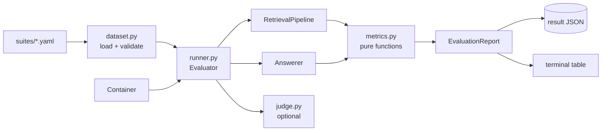

# Evaluation

*How OSC knows whether a change helped. The instrument every future retrieval
decision is read off.*

---

## Why this exists

Before it, every quality claim in this project was an opinion. Chunk size 900, overlap
120, `top_k` 5, `candidates` 30, hybrid over vector, reranking off, query rewriting
off, `recursive` over `langchain_recursive` — every one of those is a decision, and
every one was made by reasoning rather than by measurement. Some are certainly wrong.
Nobody could say which.

That is a specific, expensive failure mode. It is not that the settings are bad; it is
that **there is no way to find out**, so nobody tries, so they never improve, and the
first person to propose a change has to argue from intuition against a decision that
was also made from intuition. Work stops being cumulative.

The harness makes the project's own rule enforceable: *a retrieval change ships with a
measured improvement.*

---

## Quick start

```bash
make ingest              # suites are scored against what is actually indexed
make eval                # THE canonical command: both suites, gated
make eval-retrieval      # fast, free, ungated, no model calls — for experiments
make eval-gate           # what CI runs: retrieval only, exits non-zero on a regression
```

`./osc eval` with no arguments runs the single-turn suite **and** the conversational
suite, compares each against its committed baseline, prints the report and exits
non-zero on a regression. Answering "is OSC any good?" should not require remembering
four flags.

Or directly, for the shapes the Makefile does not cover:

```bash
./osc eval --suite conversational            # just the multi-turn suite
./osc eval --tag draft-order                 # one product area
./osc eval --concurrency 4                   # measure throughput under load
./osc eval --judge                           # add LLM-as-judge faithfulness
./osc eval --no-gate                         # measure without judging
./osc eval --profile config/experiments/hosted-anthropic.yaml --suite schema -o results/anthropic.json
```

`--output` names one file, so it is refused when more than one suite is planned —
the second would silently overwrite the first.

### The suites

| File | Shape | Scored against |
|---|---|---|
| `suites/schema.yaml` | 63 answerable + 18 abstention | `docs/company/schema` |
| `suites/conversational.yaml` | 21 sessions, 54 turns | `docs/company/schema` |
| `suites/faq.yaml` | 86 single-turn | `docs/company/faq` — preserved, not production |

Each declares its `corpus`. That is recorded rather than enforced — the harness knows
which *documents* are indexed, not which directory they came from — but it turns the
commonest failure ("every case scored zero") into a message naming the directory to
ingest.

---

## How it is put together



Four modules, one dependency direction. `dataset` and `metrics` know nothing about the
rest of the system; `judge` needs only a `ChatModel`; `runner` composes them with the
**real** pipelines built by the **real** `Container`. An evaluation that ran against a
special code path would measure the special code path.

### Three load-bearing properties

**A case never aborts the run.** A provider timeout on question 34 of 86 must not
discard the 33 results already collected. It is recorded as a failed case, excluded
from every quality mean, and counted separately. A harness that is itself fragile does
not get run, and a harness that averages a timeout in as a zero teaches the team that
the dashboard is noise.

**Every case records its trace id.** The report says recall was 0.93; the trace id on
the six cases that missed says *why*, expandable with `./osc trace <id>` long after the
run finished. Without it a bad number is the start of a reproduction rather than an
explanation.

**The configuration travels with the numbers.** A result JSON carries the chunker, the
retrieval settings, the reranker and both model ids — so comparing two runs cannot
silently compare two different systems. `compare` diffs only metrics present in both.

---

## The golden set

`evaluation/suites/schema.yaml`. 81 cases: 63 with known-correct source documents, 18 that
the corpus genuinely cannot answer.

```yaml
- id: draft-order-tag
  question: How can I tell which of my orders were created by the app?
  relevant_documents: [faq/draft-order.md]
  expected_facts: ["oscp-order-processing"]
  tags: [draft-order]

- id: abstain-pricing-plans
  question: How much does the OSCP Wholesale B2B app cost per month?
  must_abstain: true
  tags: [abstention]
```

### Two curation rules, and why they matter more than the case count

**Questions are phrased the way a user would ask them, never copied from a document
heading.** A golden set of verbatim headings measures string matching and reports it as
retrieval quality: every case scores 1.0, the number never moves for a reason anyone
can act on, and the harness becomes a ritual. Paraphrase is the whole point — it is the
gap between how content is written and how it is asked about that retrieval exists to
close.

**`expected_facts` are short, distinctive and load-bearing** — a number, a limit, a tag,
a product name. Anything longer scores the model's *phrasing* rather than its
correctness, and fails a perfectly good answer that used a synonym.

### Why abstention cases are in the set

Without them, an evaluation rewards a model that answers everything confidently — the
exact failure this system is architected against. Five questions the corpus cannot
answer are five chances to catch a regression in the abstention path, and they cost
nothing to maintain.

### Why relevance is scored at document level, not chunk level

Chunk ids are derived from chunk boundaries. Change the chunker or its size and *every
chunk id in the corpus changes* — which would invalidate the golden set on precisely
the experiment the golden set exists to run (`recursive` vs `langchain_recursive` vs
`markdown`). Document identity survives that change; chunk identity does not.

Document paths are also something a human curator can actually verify, and something
that reads sensibly in a code review diff. `relevant_documents` are corpus-relative
paths — the same string the loader records as `relative_path` on every chunk.

### The guard that stops a typo reading as a regression

Before a run starts, every `relevant_documents` entry is checked against what is
actually indexed. A mistyped path and a genuine retrieval miss both score recall 0, and
only one of them is a bug in the search stack. The check turns thirty minutes of "why
did recall collapse?" into one line naming the file.

---

## The metrics

### Retrieval — deterministic, no model calls

| Metric | Definition | What it tells you |
|---|---|---|
| `recall@k` | fraction of relevant documents present in the top *k* | **The headline.** Generation cannot recover from a passage that was never fetched, so recall bounds every downstream metric |
| `precision@k` | fraction of the top *k* that are relevant | How much of the model's finite context budget was wasted |
| `mrr` | mean of 1/(rank of first relevant) | Ordering, where recall measures presence. A correct passage ranked 8th in a top-5 retrieval is a passage the model never saw |
| `hit_rate@k` | fraction of cases with *any* relevant hit | Disambiguates recall 0.7: every question partly answered, or seven answered and three missed entirely? Different corpora, different work |

`precision@k` divides by *k*, not by the number of results actually returned:
returning three where five were requested is a real cost, because the unfilled slots
were context the model could have had.

### Generation — deterministic

| Metric | Definition | What it catches |
|---|---|---|
| `citation_coverage` | fraction of non-abstaining answers carrying ≥1 citation | A model answering without grounding |
| `groundedness` | fraction of citations whose chunk was actually in the retrieved set | **A fabricated citation.** On the native path this is impossible; on the marker-parsing path it is the exact failure mode being measured — and it needs no judge |
| `citation_precision` | fraction of citations pointing at a *golden* document | Citing something real but irrelevant |
| `fact_match` | fraction of cases where every `expected_fact` appears | The local model's [numeric-fidelity gap](../../../PROJECT_STATUS.md) — right passage, right citation, wrong number |
| `abstention_accuracy` | fraction of `must_abstain` cases that abstained | Hallucination on out-of-corpus questions |

### Generation — LLM-as-judge, opt-in

| Metric | How |
|---|---|
| `faithfulness` | `--judge`. Every claim in the answer checked against the passages it was built from |

Opt-in for two reasons. It doubles the model calls in a run, and it measures with an
instrument made of the same material as the thing being measured. The deterministic
metrics gate CI, because **a gate that can change its mind between two runs of the same
commit is not a gate**. Faithfulness is for depth — it is how the citation-strength gap
between Anthropic's verified citations and everyone else's `[n]` markers gets a number
rather than a caveat.

The judge uses `fast_llm` rather than `llm` deliberately: judging a model's output with
the identical model mostly measures self-agreement, and `fast_llm` is the seam an
operator can point at a stronger model without changing what is under test. An
unreachable judge records `None`, not a default — inflating the metric on runs where
something was wrong, or blaming the system under test for a failure in the instrument,
are both worse than an absent number.

> **Honest limitation.** An LLM judge is a biased estimator. It is used here as a
> *relative* measure between two runs of the same golden set with the same judge — a
> comparison it is good at — and not as an absolute claim. See Zheng et al.,
> [*Judging LLM-as-a-Judge*](https://arxiv.org/abs/2306.05685) (NeurIPS 2023).

### Cost and speed

`latency_p50/p95/mean_seconds`, `throughput_per_second`, `input_tokens_total`,
`output_tokens_total`. Percentiles are **nearest-rank**, so every latency reported is
one that was actually observed rather than an average of two that were not.

Throughput is meaningful only with `--concurrency > 1`; at concurrency 1 it is the
reciprocal of mean latency.

### A metric that is absent is not a metric that is zero

A `--retrieval-only` run reports **no generation metrics at all**. Letting them fall
out at zero was the first defect this harness had: `fact_match` is computed as "no
expected fact was missing", and a run that generated no answers has missed nothing — so
it scored a perfect 1.0 for work it never did. Omitting the keys also makes `compare`
refuse to diff a retrieval-only run against a full one, which is the right answer to a
comparison that was never meaningful.

---

## Running a comparison

The intended workflow, and the reason the configuration snapshot exists:

```bash
# Baseline: whatever is committed today.
./osc eval --retrieval-only -o evaluation/baselines/faq-retrieval.json

# Change one thing.
$EDITOR config/experiments/markdown-chunker.yaml     # chunking.strategy: markdown
./osc ingest --reindex --profile config/experiments/markdown-chunker.yaml

# Measure it against the baseline.
./osc eval --retrieval-only \
  --profile config/experiments/markdown-chunker.yaml \
  --baseline evaluation/baselines/faq-retrieval.json
```

The comparison table colours a delta by direction, using a table of which metrics
improve *downwards* (latency, tokens) so a latency regression is never reported as
green. It also prints every configuration key that differs between the two runs — the
cheapest possible defence against comparing two systems and calling it a result.

**Changing the chunker invalidates every stored chunk while every content hash still
matches**, so `--reindex` is mandatory. Forgetting it measures the old index under the
new label.

---

## Gating CI

```bash
make eval-gate          # ./osc eval --retrieval-only
```

**No thresholds are typed.** Each suite is compared against its committed baseline,
and every tolerance is derived from the run it judges:

| Family | Tolerance | Why |
|---|---|---|
| Retrieval | `1/n` — one case | Deterministic for a fixed index; the question is materiality, not noise |
| Generation, citations, abstention | `2 × √(p(1−p)/n)` | Two standard errors — a drop inside it is indistinguishable from re-running the same commit |
| Latency | 25%, **warning only** | Machine-dependent and heavy-tailed; a busy laptop is not a regression |
| Counts and totals | not gated | They measure the run's size, not its quality |

`n` is the number of cases that contributed to *that* metric, not the suite size:
`abstention_accuracy` over six cases is far noisier than `fact_match` over
forty-seven.

The gate also blocks **trade-offs** — an improvement bought with a regression
elsewhere, which per-metric thresholds cannot see:

| Improves | At the cost of | The gaming move |
|---|---|---|
| `precision@k` | `recall@k` | Return fewer results |
| `abstention_accuracy` | `citation_coverage` | Abstain more often |
| `latency_p50` | `recall@k` | Retrieve fewer candidates |

Retrieval-only, because a gate must be deterministic: including generation would let
it change its mind between two runs of the same commit.

Full rationale and every metric's regression criteria:
[evaluation-methodology.md](evaluation-methodology.md) and
[ADR 0014](../decisions/0014-derived-regression-tolerances.md).

---

## Committed baselines

`evaluation/baselines/` is committed; `evaluation/results/` is gitignored. Ad-hoc runs
are noise. A run worth keeping is promoted to a named file, because a baseline nobody
can see is not a baseline.

Named `<suite>-<variant>.json`, which is what the gate looks up automatically.

| File | What it records |
|---|---|
| `schema-retrieval.json` | Default profile, retrieval only. The CI gate's reference |
| `schema-full.json` | Default profile with generation. The quality reference |
| `conversational-full.json` | Default profile, multi-turn |
| `faq-retrieval.json`, `faq-full.json` | The Phase 5 corpus. Historical, not comparable to the above |

See [`evaluation/baselines/README.md`](../../../evaluation/baselines/README.md).

---

## What this does not yet measure

- **No hosted provider has been evaluated.** Every hosted adapter is exercised only via
  stubs, including the Anthropic native-citation path — the only verified citation
  implementation in the codebase. Running `--profile config/experiments/hosted-anthropic.yaml`
  is one command; it needs a credential.
- **The scenario workbooks are neither indexed nor scored.** They left the index with
  the corpus move (ADR 0011). The `.docx` and `.xlsx` parsers are still exercised by
  the end-to-end suite against generated fixtures, so parser coverage is intact, but
  no golden case scores retrieval over a spreadsheet any more.
- **`fact_match` is substring matching**, which is brittle in one direction and blind
  in the other. It is a floor on correctness, not a measure of it — see
  [evaluation-methodology.md](evaluation-methodology.md).
- **No question was written by a user.** The set was curated from the corpus, which
  means it inherits the corpus's blind spots. Real questions from
  [feedback capture](../../../PROJECT_STATUS.md) are the natural next source, and the
  reason feedback compounds.
- **Nothing measures answer *helpfulness*.** Faithfulness and fact coverage together
  say "not wrong". They do not say "useful".
- **Abstention remains a small sample.** The schema suite now has 18 must-abstain
  cases, including four held out from development inspection (ADR 0015). One case
  moves accuracy by 0.0556. The widened baseline's derived tolerance is about 0.196;
  passing that gate is weaker than meeting the separate 0.90 acceptance target.
- **The conversational suite is 21 sessions over 11 documents.** A real measurement,
  and a small one. Its numbers should not be generalised to a larger corpus.

---

## Related

- [retrieval.md](retrieval.md) — what the numbers are measuring
- [knowledge-corpus.md](knowledge-corpus.md) — why the corpus shape and the golden set are coupled
- [evaluation-methodology.md](evaluation-methodology.md) — every metric's definition, limitations, baseline and regression criteria
- [conversation.md](conversation.md) — what the conversational metrics are measuring
- [ADR 0005](../decisions/0005-evaluation-framework.md) — the decision record
- [ADR 0014](../decisions/0014-derived-regression-tolerances.md) — why tolerances are derived
