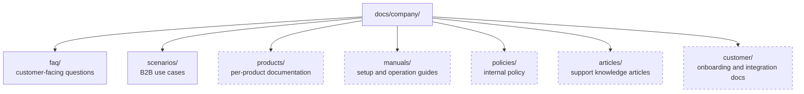

# The Knowledge Corpus

*How the corpus is organised, why, and how to grow it without a migration.*

---

## The one rule

**`corpus.root` is the corpus. Everything the assistant can retrieve lives under it,
and nothing else does.**

```
docs/
├── company/
│   ├── schema/       ← INGESTED. The authoritative knowledge source.
│   ├── faq/          ← not indexed. Merchant-facing; the Phase 5 corpus.
│   └── scenarios/    ← not indexed.
└── engineering/      ← NOT ingested. This knowledge base.
```

`corpus.root` is `docs/company/schema` in the default profile, and **it is named in
exactly one place**. `./osc ingest` with no argument reads it, `./osc doctor` checks
it, and the empty-index startup note quotes it.

That was three literals until Phase 6 — one in the `Makefile`, one on the `doctor`
command, one in the startup banner — kept equal by a rule people had to remember.
A rule that survives only as long as everyone remembers it is not a boundary, and
this particular boundary protects the one corpus mistake that produces no error, no
warning and no failing metric. See [ADR 0010](../decisions/0010-corpus-root-is-configuration.md).

### Why `schema/` and not all of `company/`

The FAQ and the schema documents describe the same product to different readers. The
FAQ answers *"why is my discount not showing on the cart page?"* for a merchant; the
schema documents answer *"which namespace and key holds the add-on tier pricing
payload?"* for an engineer. Indexing both puts them in competition: a developer asking
for a metafield key would retrieve a merchant-facing answer that does not contain one.

The FAQ is preserved on disk and as a **runnable evaluation suite** — it is the only
suite over prose documents, which makes it the control when a retrieval change is
suspected of being specific to the schema corpus's tables and JSON. See
[ADR 0011](../decisions/0011-schema-first-knowledge-corpus.md).

### Why the split exists

Before this iteration the ingest root was `docs/`, and the only thing under it was
company content — so the two were the same directory by accident rather than by
design. Adding an engineering knowledge base broke that: without the split, an
employee asking "how does OSC handle refunds?" could be answered from an ADR about
reciprocal rank fusion, with a citation, confidently.

The failure mode is worse than it sounds because it is invisible. Retrieval would
succeed, generation would be grounded, the citation would be correct — and the answer
would be about the wrong universe. There is no downstream check that catches it. So
the boundary is enforced at the only place it can be: what gets indexed.

---

## Current contents

| Path | Format | Indexed | What it is |
|---|---|---|---|
| `schema/*.md` | Markdown, 11 files | **yes** | OSCP module persistence schemas — metafield inventories, metaobject field tables, Prisma models, sample payloads |
| `faq/*.md` | Markdown, 17 files | no | The OSCP Wholesale B2B advance FAQ, one file per topic area |
| `scenarios/*.docx` | Word, 2 files | no | B2B scenario documents |
| `scenarios/*.xlsx` | Excel, 2 files | no | Wholesale scenario templates and quantity-clubbing use cases |

The indexed corpus is 11 documents / 80 chunks under `markdown` chunking. These
documents are mostly tables and JSON rather than prose, which is why the chunker
choice matters more here than it did on the FAQ — see
[ADR 0012](../decisions/0012-markdown-chunking-measured.md).

`./osc status` is authoritative for the live counts.

---

## Why the FAQ is 17 files and not one

It arrived as a single 633-line document. It was split, on three grounds — and the
first is the one that mattered.

**Retrieval metrics need more than one document to be meaningful.** A golden set names
the documents that answer a question. With a one-document corpus, `recall@5` is 1.0
for every question that has an answer at all, `precision@5` is a constant, and MRR is
1.0 — the numbers exist, move for no reason, and measure nothing. Seventeen
topic-scoped documents make document-level retrieval a real discrimination task, which
is what turns [evaluation.md](evaluation.md) from theatre into an instrument.

**Citations get better.** A citation reading *Tax Display* tells a user what they are
looking at. One reading *Advance FAQ* tells them nothing they did not already know.

**Chunks get topically coherent neighbours.** Chunk boundaries land inside a single
subject rather than at the seam between "Draft Order" and "Free Gift", so a chunk that
partially overlaps a question is more likely to be about that question.

The split preserved all 89 questions verbatim; only structure changed.

---

## How to add knowledge

### Adding a document

Drop the file in the right subdirectory and run `make ingest`. That is the whole
procedure. Ingestion is idempotent and incremental — unchanged files are skipped by
content hash, changed files are re-chunked and re-embedded, deleted files are pruned.

Supported formats: `.md`, `.markdown`, `.txt`, `.rst`, `.html`, `.htm`, `.pdf`,
`.docx`, `.xlsx`. Anything else is reported by `./osc doctor` under `corpus` rather
than silently ignored.

### Adding a category

Create a directory. There is no registry to update, no configuration to change, and no
code that enumerates the categories — `FilesystemLoader` walks the tree and the
relative path travels into every chunk's metadata as `relative_path`.

The intended growth, none of which needs a change to the ingestion layer:



Dashed boxes do not exist yet. They are drawn to make the point that they do not need
to be designed for — the corpus layout is a filesystem tree, and a filesystem tree
already scales to this.

### Conventions worth keeping

- **One topic per file.** The unit of retrieval metrics and of citation display.
- **An H1 on the first line.** `_derive_title` uses it as the document title, which is
  what appears next to a citation. Without one, the filename is used.
- **Headings that read as questions where the content is Q&A.** The heading path is
  available to the `markdown` chunker and the heading text is embedded along with the
  body, so a heading that matches how users ask improves retrieval directly.
- **Kebab-case filenames.** They become the `relative_path` a golden set refers to.

### Conventions deliberately *not* adopted

- **No YAML frontmatter.** `parse_text` reads Markdown verbatim, so frontmatter would
  be embedded and quotable as citation evidence — a citation reading `tags: [pricing]`
  is worse than no citation. If structured metadata is needed later it belongs in a
  sidecar or in the parser, not in the retrievable text.
- **No index or README inside `docs/company/`.** It would be ingested and retrieved,
  and an index page answers no question a user has.
- **No manual document ids.** They are SHA-256 digests of the file URI, derived, and
  stable as long as the path is.

---

## Access control, and why the corpus is currently uniform

Every document here is readable by everyone who can reach the service, because the
service has no authentication (`PROJECT_STATUS.md` §8). That is not an oversight in
the corpus design — Phase 1 was **scoped to company-wide-readable content
specifically** so that per-document ACLs were not yet needed.

The consequence for anyone adding content today: **do not put anything in
`docs/company/` that is not safe for every employee to read.** When ACLs land, they
will be resolved at index time from the source system and enforced as a SQL predicate
at query time, so an unauthorised chunk is never retrieved rather than being retrieved
and filtered. Until then the boundary is the directory.

---

## Related

- [evaluation.md](evaluation.md) — why the corpus shape and the golden set are coupled
- [chunking-and-embeddings.md](chunking-and-embeddings.md) — what happens to a document after it is loaded
- [ADR 0007](../decisions/0007-knowledge-corpus-layout.md) — the decision record for this layout
