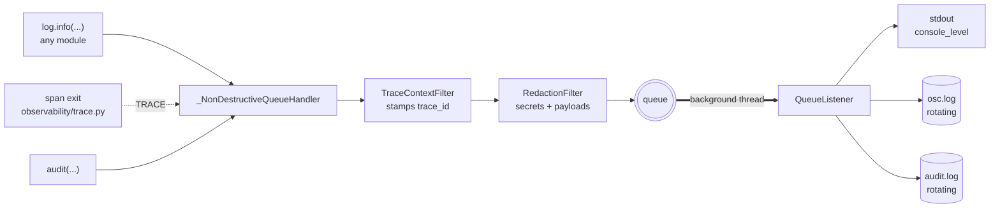

# Logging

*What the system did, recorded durably. The other half of observability.*

---

## Logging and tracing are not the same thing

They answer different questions and OSC needs both.

| | Tracing | Logging |
|---|---|---|
| Answers | *How did **this** execution spend its time?* | *What happened, across **all** executions?* |
| Shape | A tree of spans, one operation | A flat, ordered stream |
| Lifetime | Bounded ring buffer + JSONL, recent only | Rotating files, hours to months |
| Read by | A developer debugging one request | An operator grepping last Tuesday |
| Owner | [`observability/`](observability.md) | `logging.py` |

A trace explains one request beautifully and cannot tell you that the same failure
happened 40 times overnight. A log tells you that and cannot show you which stage
was slow. The two are joined by one field: **`trace_id` is stamped on every log
record**, so a line in the log expands into a full waterfall with
`./osc trace <id>`.

---

## Where logs go

```
.osc/logs/
├── osc.log       operational stream — rotates at max_bytes, backup_count kept
├── osc.log.1
├── osc.log.2
└── audit.log     one record per answered question — longer retention
    └── audit.log.1
```

```bash
./osc logs                    # location, sizes, ceiling, last 20 lines
./osc logs --audit            # the audit stream instead
./osc logs -f                 # prints the tail -f command for the right file
tail -f .osc/logs/osc.log | jq .
```

`./osc logs` is a discovery command, not a viewer. `tail`, `grep` and `jq` already
read JSONL better than anything worth writing; the hard part is knowing *which*
file to point them at once rotation has produced six.

---

## The architecture



### Four properties that are load-bearing

**Writing is off the calling thread.** Every handler sits behind a
`QueueHandler`/`QueueListener` pair. A log call costs an enqueue; disk I/O happens
on a background thread. Logging that blocks a request on `fsync` is logging that
gets deleted the first time it appears in a latency profile.

**Every record carries its trace id.** A filter reads the tracer's context var and
stamps it. Without this field, logs and traces are two piles of facts about the
same request with nothing joining them.

**Disk is bounded by construction.** `max_bytes * (backup_count + 1)` — roughly
60 MB by default. The oldest rotated file is *deleted*, not archived.

**Redaction applies to every destination.** It is a filter on the queue entry
rather than a formatter concern, because a secret suppressed on disk and printed
to stdout is a secret that leaked.

---

## Coverage comes from the span bridge

This is the part worth understanding, because it is why the logging system has
pipeline-wide coverage without a single new call site in the pipelines.

**Every stage of OSC is already a `span()` carrying structured attributes** —
`retrieve`, `embed_query`, `search`, `threshold`, `rerank`, `generate`, `finalise`,
`load_hashes`, `document`, `chunk`, `embed`, `store`, `prune`. The tracer already
collects them. So logging does not
add instrumentation; it **subscribes** to the instrumentation that exists:

```python
# observability/trace.py, on span exit
_log_span(entry, current.trace_id)   # one TRACE record per stage
```

The result, with `OSC_LOG_LEVEL=TRACE`:

```
TRACE embed_query     768.35ms  trace=505cd599
TRACE search           52.03ms  trace=505cd599
TRACE threshold         0.01ms  trace=505cd599
TRACE rerank            0.01ms  trace=505cd599
TRACE retrieve        821.06ms  trace=505cd599
```

`retrieval/pipeline.py` was not modified to produce that. Neither was any provider,
chunker or store. The alternative — hand-written log lines in each pipeline — would
have been a second set of instrumentation to keep in step with the first, and the
two would drift on the first change nobody made twice.

It costs nothing when unused: `_log_span` checks `isEnabledFor(TRACE)` before
building anything, so an INFO run pays one integer comparison per span.

---

## Levels

| Level | | What appears |
|---|---|---|
| `TRACE` | 5 | Every pipeline stage (`span.complete`), with attributes and timings |
| `DEBUG` | 10 | Pipeline construction, configuration resolution |
| `INFO` | 20 | Startup, CLI invocation, HTTP requests, ingestion, generation, component construction, shutdown |
| `WARNING` | 30 | Uncited answers, failed rewrites, unclosable components, unreadable files |
| `ERROR` | 40 | Request failures, with traceback |

**The console can be quieter than the file.** An interactive CLI command prints its
answer rather than a JSON stream, but the file keeps recording at the configured
level — quietening the terminal must not throw away the log, which is the easy
mistake when one level controls both destinations. `configure_logging` takes
`console_level` for exactly this.

**Third-party libraries are pinned to WARNING** regardless of ours. Raising the
level to TRACE to watch our own pipeline must not turn on every vendor SDK's debug
stream: those emit unstructured prose into a JSONL file, carry request bodies that
may contain corpus text, and drown the records worth reading.

---

## Configuration

```yaml
log_level: INFO          # TRACE | DEBUG | INFO | WARNING | ERROR
log_format: json         # console format; the file is always JSON

logging:
  directory: .osc/logs   # null disables file logging entirely
  max_bytes: 10000000    # rotate here
  backup_count: 5        # ceiling = max_bytes * (backup_count + 1)
  audit: true
  audit_max_bytes: 10000000
  audit_backup_count: 20 # deliberately higher than backup_count
  capture_payloads: false
  log_spans: true
```

Every value is addressable from the environment:
`OSC_LOG_LEVEL=TRACE`, `OSC_LOGGING__CAPTURE_PAYLOADS=true`,
`OSC_LOGGING__DIRECTORY=/var/log/osc`.

`directory: null` disables file logging — the right setting for a container that
ships stdout to a collector, and what the test suite uses. `OSC_LOGGING__DIRECTORY`
accepts an empty value, `null` or `none` for the same thing. That takes a validator:
an environment variable is always a *string*, so `Path | None` would otherwise read
`null` as a relative directory named `null` and an empty value as the working
directory — both silently creating log files rather than disabling them. Both were
observed. Disabling file logging is the setting a containerised deployment wants,
and a container configures through the environment; a setting reachable only from
YAML is not reachable where it is needed.

---

## Security

**Credentials are redacted unconditionally.** Any field whose *name* contains
`key`, `token`, `secret`, `password`, `dsn`, `credential` or `authorization` becomes
`[redacted]`. Matched on the field name rather than the value: a heuristic that
inspects values both misses novel formats and mangles legitimate content.
`capture_payloads` cannot re-enable this.

**The heuristic has an allowlist, and it earned it.** `input_tokens` contains
"token" and is a *cost measurement*. Redacting it silently destroyed every token and
spend analysis in the log — caught by reading a real audit record during
implementation, not by a test. `NEVER_REDACT` now guards the token counts and chunk
id lists, and a regression test pins it.

**Corpus text is reduced to a length by default.** `question`, `answer`, `query`,
`text`, `prompt` and friends become `<47 chars>` unless `capture_payloads` is on.
That keeps every timing and count an investigation needs while keeping corpus
content out of a file that tends to get shipped elsewhere.

---

## The audit stream

`audit.log` carries one record per answered question, written from
`generation/answerer.py` so that both the buffered and streaming paths are covered
by one call site.

```json
{"event": "answer", "trace_id": "88ab90f4457d4cca", "model": "qwen3:8b",
 "abstained": false, "question": "<47 chars>", "citations": 1,
 "retrieved_chunk_ids": [...], "cited_chunk_ids": [...],
 "retrieved_documents": [...], "input_tokens": 1563, "output_tokens": 21,
 "retrieval_ms": 827.97}
```

**Why separate.** Operational logs roll off in hours under TRACE. "Which passages
did we show this user in March" has to outlive that. One stream would mean one
retention policy for both, and the debug firehose would win.

**Why it survives a coarser level.** The audit handler is pinned at INFO, so raising
the root to WARNING to quieten a noisy deployment does not silently stop recording
what was answered.

**What it contains by default.** The skeleton — chunk ids, document ids, model,
tokens, abstention, trace id — and the text only under `capture_payloads`. Chunk ids
make an answer fully reconstructable with `./osc chunk <id>` by someone who already
has index access, without putting corpus content in the file.

---

## Debugging workflows

**"A user says the answer was wrong an hour ago."**

```bash
grep '"event": "answer"' .osc/logs/audit.log | jq 'select(.citations == 0)'
./osc trace <trace_id>          # the full waterfall for that request
./osc chunk <cited_chunk_id>    # the exact text the model was shown
```

**"Something is slow and I do not know which stage."**

```bash
OSC_LOG_LEVEL=TRACE ./osc ask "..." &
tail -f .osc/logs/osc.log | jq 'select(.event == "span.complete") | {span, duration_ms}'
```

**"What is this process actually configured to do?"**

```bash
jq 'select(.event == "settings.resolved")' .osc/logs/osc.log | tail -1
```

**"What has anyone actually run on this box?"**

```bash
jq -r 'select(.event == "cli.command") | "\(.timestamp) \(.command) \(.flags | join(" "))"' \
  .osc/logs/osc.log
```

`cli.command` is emitted by `load()`, which every command calls, and names the
command before anything else happens. Without it the log is a stream of identical
`settings.resolved` and `component.built` records with no way to tell an `ask` from
an `ingest` from a `doctor` — every command initialises the same way.

It reads `sys.argv` rather than the click context, because typer invokes a
command's callback outside the context `click.get_current_context` reads. The
positional tail is *payload* — `osc ask "<a real question>"` puts user text on the
command line — so `argv` appears only under `capture_payloads`. The option flags
are always recorded; option values that change behaviour are already in
`settings.resolved`.

**"What did the service construct, and did it release it?"**

```bash
jq 'select(.event | startswith("component.") or startswith("container."))' .osc/logs/osc.log
```

---

## Known limits

- **Rotation is size-based, not time-based.** Disk is bounded; retention *windows*
  are not predictable. A quiet week keeps more history than a busy hour. This is the
  right trade for a bounded-disk guarantee and the wrong one if you need "exactly 30
  days" — see [ADR 0009](../decisions/0009-persistent-logging.md).
- **Logs are process-local.** No shipping, no aggregation. Same limitation the trace
  store has, and the same answer: an exporter, once more than one host matters.
- **The queue is unbounded.** A pathological burst grows memory rather than dropping
  records. Dropping a diagnostic to bound memory trades away the thing you are
  reading, and the rotating file already bounds disk.
- **`http.response` duration is time-to-first-byte for streaming.** A streaming
  response completes when its headers are sent; the full generation time is on the
  trace.
- **No log shipping config.** Deployment concern, not yet a deployment.

---

## Related

- [observability.md](observability.md) — the tracing half
- [ADR 0009](../decisions/0009-persistent-logging.md) — the decision record
