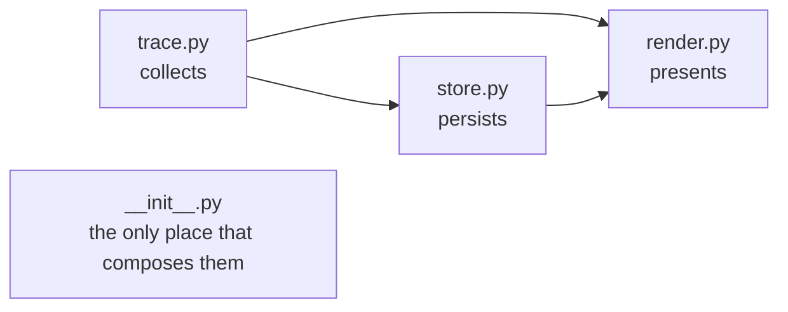
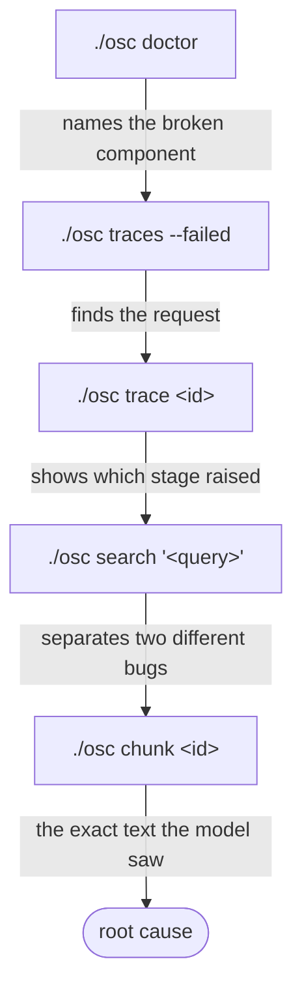

# Observability

*How to find out what actually happened, without adding a log line, attaching a
debugger, or reproducing the request.*

---

## The design goal

One request produces **one trace**. Every significant stage is a timed span. That trace
**survives the process that made it**. Given a trace id, a developer can see where the
time went, how the data changed between stages, and which stage failed — hours later,
on a different machine, for a request nobody thought to instrument.

The alternative — reproducing the request — does not work for this system. A generation
is not deterministic: re-running produces *a* trace, not *the* trace, and the answer
under investigation is usually the odd one out.

---

## Three modules, one direction



**`trace.py`** — a context-var span tree.

- `span()` **outside** a trace returns a detached span that records nothing. This is
  why instrumented code carries no `if tracing:` branches anywhere in the codebase.
- `trace()` nested inside another trace **extends** it rather than forking. That is what
  lets `retrieve` be both a whole operation (`./osc search`) and a stage of a larger one
  (`./osc ask`) with no conditional.
- Bounded by `max_spans_per_trace`, with the dropped count recorded so totals stay
  accurate past the cap.
- Because spans live in a `ContextVar`, concurrent asyncio tasks get independent traces
  for free — which is what makes `./osc eval --concurrency 4` produce one clean trace
  per case.

**`store.py`** — a bounded, append-only JSONL log.

- Rotation, not rewriting: appending is O(1).
- **Writing never raises.** Instrumentation that can break the thing it observes is a
  liability, because it is trusted.

**`render.py`** — the waterfall and the one-line summary. Bars are positioned by offset
and sized by duration, so "these ran back to back" and "this one dominated" are
distinguishable at a glance rather than by reading numbers.

---

## Why a JSONL file

The in-memory ring buffer works for the server: the process is long-lived, so
`/api/traces` answers "what did that request just do?" with no storage at all. It does
not work for the CLI, where the process exits the moment the answer is printed. A
developer who did not think to pass `--explain` had no way back to the trace.

| Option | Rejected because |
|---|---|
| Re-run with `--explain` | A generation is not deterministic. It also costs a full model call and cannot explain a failure that already happened in CI |
| A `traces` table in PostgreSQL | Puts write load on the primary datastore for a debugging feature, and makes tracing unavailable in exactly the situation where it is most wanted: when the database is what is broken |
| OpenTelemetry + collector | Right destination once traces leave the host, wrong answer for reading a trace in a terminal. `Span` stays OTel-shaped so this remains an exporter, not a rewrite |
| A daemon or socket | A background process to read a trace is worse than the problem |

**Chosen: a bounded append-only JSONL log**, plus **auto-explain on failure**, which
needs no persistence at all. The file is the smallest thing that outlives a process; it
needs no service, schema or migration; it works identically for the CLI, the server and
CI; and it uses exactly the payload the HTTP endpoint already serves, so one parser and
one renderer cover both sources.

---

## The debugging workflow

Each step narrows the next. This is the intended loop and it is worth learning in
order.



1. **`./osc doctor`** — names the broken component on one line. Most surprises come
   from outside the process: a stopped database, an unpulled model, an expired
   credential.
2. **`./osc traces --failed`** — finds the request. Also `--name`, `--slower-than`.
3. **`./osc trace <id>`** — expands one trace into a waterfall: which stage raised, and
   what every earlier stage had already done.
4. **`./osc search "<query>"`** — separates *"the model misread the passage"* from
   *"the passage was never retrieved"*. Different bugs, different fixes, and nothing
   else distinguishes them.
5. **`./osc chunk <id>`** — the exact text the model was given.

**A failing command prints its trace automatically.** `--explain` is for when it
succeeded and you still want to know how.

---

## Rules for new code

These are the rules in `CLAUDE.md`, with the reasoning that is not in it.

**A new pipeline stage gets a span.** `with span("name", **attributes)`, where the
attributes describe *how the data changed* — counts, ids, scores — not prose. `kept=12,
discarded=18` is a fact you can act on; `"filtering candidates"` is a sentence you
already knew.

**Instrument the pipeline, not the adapter.** Every provider call is made from a
pipeline, so wrapping the call sites covers all 37 providers at once, keeps adapters
pure translation, and means a new provider is traced the day it is written. An adapter
that imported the tracer would be 37 places to keep consistent.

**Anything derived from a document or a user goes through `set_text`, never `set`.**
That is the seam `observability.capture_text: false` switches off — it reduces text to
a length while retaining every timing, count and stage. A trace that cannot be
sanitised is a trace that cannot be kept.

**Never let instrumentation raise.** A tracer that can break the thing it observes is a
liability precisely because it is trusted.

---

## Structured logging

`logging.py` is a JSON formatter on stdlib `logging` — no third-party logging
dependency, because a formatter is thirty lines and a dependency is forever.

The output split is load-bearing: **machine-readable output goes to stdout,
human-readable output goes to stderr.** `./osc serve > run.log` must still produce a
clean parseable log while the terminal shows where the service is listening. Two
audiences served by two streams, rather than one audience served badly.

Interactive CLI commands suppress the service's own INFO logs by default. A structured
JSON stream is the right output for a running service and the wrong output for a
terminal, where it buries the answer the operator asked for. `--verbose` restores it.

---

## Privacy

Trace text may contain corpus content: questions, rewritten queries and answers are
recorded by default.

- `observability.capture_text: false` retains every timing, count and stage while
  reducing text to a character count.
- The HTTP trace endpoints are **additionally** refused outside
  `environment: development`, and **that check is not overridable by configuration** —
  traces carry question text and chunk ids, and no endpoint on this service is
  authenticated yet.

---

## Configuration

```yaml
observability:
  enabled: true
  trace_buffer_size: 50          # in-memory, for the server
  max_spans_per_trace: 500       # a corpus-wide ingest cannot grow unbounded
  log_traces: true
  persist_traces: true           # the JSONL log
  trace_dir: .osc
  max_trace_file_bytes: 5000000  # two files kept, so ~2x this on disk
  capture_text: true
  expose_traces: true            # still gated on environment == development
```

---

## Known limits

- **Traces are process-local and lossy.** The log is bounded and lives on one host. It
  answers "what happened recently, here", not "what happened last Tuesday across the
  fleet". That needs the OTel exporter, which `Span` is already shaped for.
- **Trace reads are whole-file.** `TraceStore._read_backwards` reads both files to serve
  twenty summaries. Bounded by `max_trace_file_bytes` and fine at 5 MB; marked in the
  source with a `ponytail:` comment naming seek-from-end as the upgrade if that limit
  rises.

---

## Related

- [../technologies/graphify-and-ponytail.md](../technologies/graphify-and-ponytail.md) — development-time tooling
- [ADR 0004](../decisions/0004-persistent-tracing.md) — the decision record
