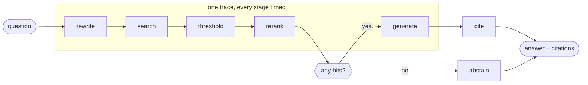
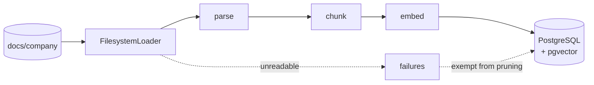
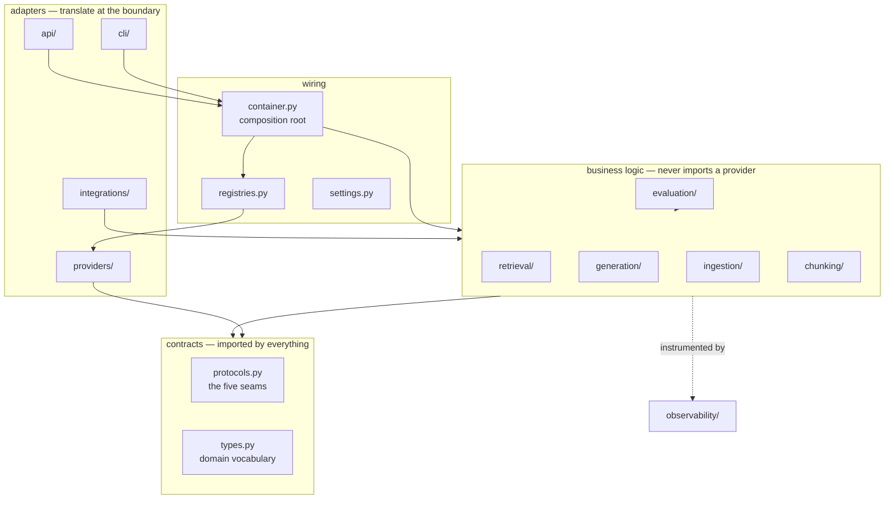

# Architecture Overview

*The whole system on one page: what it does, how a request flows through it, and why
the module boundaries are where they are.*

---

## What OSC is

A retrieval-augmented question answering service over OSC's own documents. An employee
or a support agent asks a question; the system finds the passages in the corpus that
bear on it, asks a language model to answer **using only those passages**, attaches
citations back to the source files, and declines to answer rather than guessing when
the corpus does not support one.

That last clause is architectural, not cosmetic. Almost every design decision below
follows from two requirements that pull against each other:

- **Minimal hallucination.** An internal knowledge assistant that invents a refund
  policy is worse than no assistant, because people act on it.
- **Vendor agnosticism.** Every model in this system will be replaced. The one that
  is state of the art when you read this will not be in eighteen months.

Grounding solves the first. Protocols solve the second. Everything else is
consequence.

---

## The request path

1. **Rewrite** — resolves conversational references ("what about the second one?")
   into a standalone query using the configured *fast* model. Best-effort: any failure
   falls back to the original question and records why on the span. Off by default
   until its benefit is measured.
2. **Search** — vector, keyword, or hybrid. See [retrieval.md](retrieval.md).
3. **Threshold** — `min_score` applied to *first-stage* scores, before reranking,
   because only those are on a known scale.
4. **Rerank** — `noop` by default; a cross-encoder is available and unmeasured.
5. **Generate** — the retrieved chunks become `sources` on a provider-neutral
   `ChatRequest` alongside a frozen system prompt.
6. **Cite** — Anthropic passes sources as structured documents and returns citations
   verified against the source text. Every other provider renders sources into the
   prompt and has its `[n]` markers parsed back out. Both produce the same `Citation`
   shape — and that symmetry is a
   [known limitation](../../../PROJECT_STATUS.md), not a claim of equivalence.
7. **Abstain** — no retrieval hits means **the model is never called**. No citations
   means the answer is treated as ungrounded. Abstention is a code path, not a prompt
   instruction, because a prompt instruction is a request and a code path is a
   guarantee.

## The ingestion path

Idempotent and incremental: unchanged documents are skipped by content hash, changed
documents are replaced atomically, absent documents are pruned. A file that is present
but *unreadable today* is recorded as a failure and **exempted from pruning** — the
distinction between "deleted at source" and "temporarily unparseable" is the
difference between a correct sync and permanent data loss.

---

## Module map

### The two rules that hold it together

**1. Business logic imports `protocols` and `types` only. It never imports a
provider.** This single rule is what makes vendor agnosticism real rather than
aspirational, and it is checkable with a grep. If a pipeline, route or CLI command
ever imports `providers/`, the property is gone.

**2. `integrations/` may import from the core; the core may never import from
`integrations/`.** That one-way edge is what stops an outbound adapter — OSC's
retriever exposed as a LangChain `BaseRetriever` — from becoming a dependency of the
platform.

### What lives where

| Module | Responsibility |
|---|---|
| `protocols.py` | Five `Protocol` definitions plus optional `StoreInspector` |
| `types.py` | Frozen dataclasses; the only vocabulary that crosses module boundaries |
| `registries.py` / `registry.py` | Name → factory. A provider registers itself on import |
| `settings.py` | Layered config: env > `.env` > YAML profile |
| `container.py` | Composition root; lazy `cached_property` construction; lifecycle |
| `errors.py` | `AssistantError` hierarchy — the vocabulary for operator problems |
| `fusion.py` | Reciprocal Rank Fusion, reference implementation |
| `grounding.py` | Source rendering, citation parsing, reasoning-model hygiene |
| `observability/` | `trace` collects · `store` persists · `render` presents |
| `evaluation/` | `dataset` · `metrics` · `judge` · `runner` |
| `providers/` | 37 adapters across five registries |
| `api/` · `cli/` | The two human-facing edges |

---

## Cross-cutting design decisions

**Protocols, not base classes.** Structural typing means a provider is compatible by
virtue of its *shape*. There is no base class to inherit and no registration ceremony
beyond one line. The practical consequence is that a test double is indistinguishable
from a provider — which is what makes the API and CLI test suites meaningful rather
than decorative.

**One datastore.** PostgreSQL holds chunk text, embeddings, the lexical index and
document metadata. A chunk and its vector cannot drift apart, there is one backup, and
hybrid retrieval is one round trip instead of two systems and a join in application
code.

**Frozen dataclasses for domain types.** These values are constructed internally and
never parsed from untrusted input; validation belongs at the trust boundary (API
schemas, settings, golden sets), not in the domain.

**Frozen prompts.** Module constants with no interpolation, so the prefix stays
byte-identical. Anything dynamic breaks prefix caching and makes evaluation results
unattributable — you would not know whether a score moved because the retrieval
changed or because the prompt did.

**Instrumentation in pipelines, not adapters.** Every provider call is made *from* a
pipeline, so wrapping the call sites covers all 37 providers without a single adapter
importing the tracer — and a new provider is traced the day it is written.

**Human output on stderr, machine output on stdout.** `./osc serve > run.log` yields a
clean parseable JSON log while the terminal still shows where the service is
listening. Two audiences, two streams, neither compromised.

**Operator errors are messages; bugs are tracebacks.** `AssistantError` and its
subclasses each carry an actionable message and are reported as one line. Anything
else keeps its frames, because for a bug the frames are the point.

**`workspace_id` from day one.** The only speculative design in the codebase, and
defended on one ground: adding a partition key to a populated corpus is a data
migration, and not adding it is a column.

---

## Where the architecture is weakest

Stated here rather than buried, because a knowledge base that only lists strengths is
marketing.

- **No authentication.** `/api/chat` and `/api/search` accept arbitrary
  unauthenticated input. The service announces this at startup outside development;
  the constraint still lives in prose rather than in the code path.
- **Citation strength differs by provider, silently.** Both paths produce the same
  `Citation` object, so nothing downstream can tell a verified citation from a parsed
  marker. Quantifying that gap is a job for the evaluation harness.
- **The local answer model misreads figures.** Observed: `qwen3:8b` rendered
  "500 to 2,500 EUR" as "50,000 to 2,500 EUR" while citing the correct passage.
  Retrieval right, citation right, number wrong.
- **Traces are process-local.** They answer "what happened recently, here", not "what
  happened last Tuesday across the fleet".

---

## Related

- [provider-architecture.md](provider-architecture.md) — the five seams in detail
- [retrieval.md](retrieval.md) — hybrid search and fusion
- [observability.md](observability.md) — the debugging workflow
- [evaluation.md](evaluation.md) — how any of the above is judged
- `PROJECT_STATUS.md` — the current engineering report and handover document
