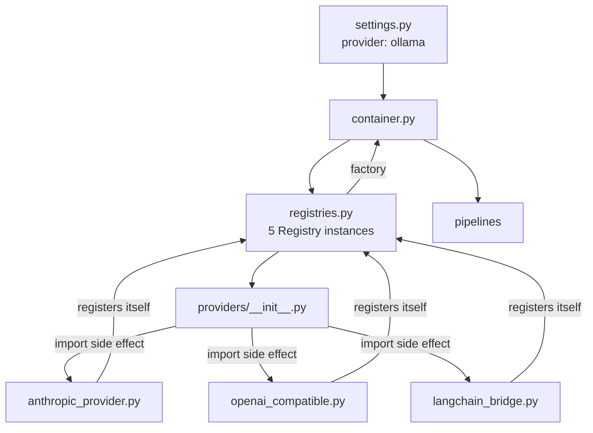
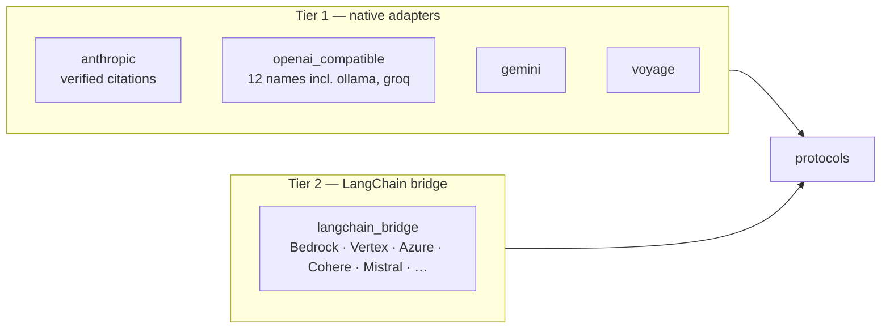

# Provider Architecture

*How 37 providers are swappable by configuration, with no change to any line of
business logic.*

---

## The problem it solves

Every model in this system will be replaced. Not *might be* — will be. The chat model
that is state of the art today will be superseded; the embedding model will be beaten
on the MTEB leaderboard within months; the vector store may need to move when the
corpus outgrows one machine. A design that couples business logic to any of them buys
a rewrite on each of those events.

The requirement was stated up front: **switching providers must require configuration
changes only.**

---

## The five seams

Everything swappable is a `Protocol` in `src/osc_assistant/protocols.py`.
Implementations satisfy them **structurally** — no base class, no inheritance, no
registration ceremony.

| Protocol | Responsibility |
|---|---|
| `ChatModel` | `complete()` / `stream()`; declares `supports_citations` |
| `EmbeddingModel` | `embed_documents()` / `embed_query()`; declares `dimensions` |
| `VectorStore` | `replace_document()`, `delete_document()`, three search methods, hash listing |
| `Reranker` | `rerank(query, candidates, top_k)` |
| `Chunker` | `split(document) -> list[Chunk]` |

Plus one **optional** protocol, `StoreInspector`, carrying read-only introspection:
statistics, document listing, chunk lookup.

### Why `StoreInspector` is separate

Every method on `VectorStore` is one a new store *must* implement to be usable at all.
A hosted vector database that exposes no aggregate API should still be a perfectly good
`VectorStore` — it can store, search and delete. Folding `statistics()` into
`VectorStore` would make that database non-conforming for a reason unrelated to
retrieval.

So tooling probes for it with `isinstance` and reports its absence rather than failing.
Both built-in stores implement it.

The general rule this expresses: **the last change to `VectorStore` removed a method
rather than adding one, and that direction is worth protecting.** A protocol that keeps
growing stops being a seam and becomes a base class with extra steps.

### Why protocols and not abstract base classes

```python
class MyStore:                       # inherits nothing
    async def search_vector(...): ...
    async def search_keyword(...): ...
```

Structural typing means a provider is compatible by virtue of its shape. Three
consequences, in increasing order of importance:

1. A new provider is one file and one import line.
2. A third-party object can satisfy the protocol without knowing OSC exists.
3. **A test double is indistinguishable from a provider.** This is the one that
   matters. The API and CLI test suites register in-process doubles through the
   ordinary registry — the same path a real provider takes — so "the whole stack can be
   retargeted by configuration alone" is *asserted by the test suite*, not assumed.

See [PEP 544](https://peps.python.org/pep-0544/) for the language feature.

---

## Wiring: registry and composition root



`registries.py` holds five `Registry` instances mapping a provider name to a factory. A
provider module registers itself on import; `providers/__init__.py` imports the
sub-packages; `container.py` imports that package once.

**Nothing in the call path imports every possible implementation.** The registry is
populated as a side effect of one import at the composition root, and the pipelines
never see any of it.

### Lazy construction, and why it matters operationally

`Container` builds components via `cached_property`, so `./osc ingest` never constructs
a chat model and therefore **never needs an LLM credential**. That is not a
micro-optimisation; it is the difference between an ingestion job that runs in a
restricted environment and one that does not.

The same mechanism gives shutdown its correctness property: `cached_property` stores
into the instance `__dict__`, so *its presence there is exactly the record of what was
constructed*. `Container.shutdown()` releases every component that was actually built
and constructs nothing that was not, probing for `aclose()` or `close()` rather than
requiring one — most providers hold no resource.

### What the container injects

The vector store cannot know its own vector width or which embedding model produced the
vectors it holds. Both are derived from the embedding model and injected at
construction, which is what lets the store refuse to compare vectors made by different
models instead of silently returning nonsense similarity scores.

---

## The two-tier provider strategy



**Tier 1 — native adapters** are the default path and keep provider-specific
capabilities: Anthropic's verified citations, the reasoning controls on the
OpenAI-compatible family. They are written and maintained here.

**Tier 2 — the LangChain bridge** wraps any LangChain `BaseChatModel` or `Embeddings`
behind OSC's protocols, making the long tail reachable by configuration rather than by
writing an adapter each time. The cost is marker-parsed citations and one more layer.

The class is named by import path in `options.class_path` rather than resolved by
`init_chat_model`, which lives in the `langchain` meta-package and would pull LangGraph
in to save one line of configuration.

---

## Adding a provider

```python
# src/osc_assistant/providers/llm/newvendor.py
from ...registries import LLM_REGISTRY
from ...types import ChatRequest, ChatResponse

class NewVendorChatModel:
    @property
    def model_id(self) -> str: ...
    @property
    def supports_citations(self) -> bool: return False
    async def complete(self, request: ChatRequest) -> ChatResponse: ...
    async def stream(self, request): ...

LLM_REGISTRY.register("newvendor", lambda config: NewVendorChatModel(config))
```

Then one import line in `providers/llm/__init__.py`. That is the whole procedure. No
pipeline changes, no interface to inherit, no test to update — the existing contract
tests already cover it.

### The one rule an adapter must obey

**Never let a vendor exception escape.** Translate it into the `AssistantError`
hierarchy at the adapter boundary, or the layers above cannot handle it. This was
learned the expensive way: untranslated `asyncpg` exceptions surfaced as a bare
`OSError` traceback in the CLI *and bypassed the API's error handler entirely* — the
most common operational failure was also the worst reported.

Adapters also stay **pure translation**. No tracing, no retries, no logging beyond
errors. Instrumentation lives in the pipelines, so wrapping the call sites covers all
37 providers at once and a new adapter is traced the day it is written.

---

## Configuration

```yaml
llm:
  provider: ollama            # a registered name
  model: qwen3:8b
  options:                    # passed through to the factory
    include_usage_in_stream: true
```

Layered, highest precedence first: process environment → `.env` → YAML profile. Any
value is addressable from the environment with `OSC_` and `__` for nesting:

```bash
OSC_LLM__PROVIDER=groq OSC_LLM__MODEL=llama-3.3-70b-versatile ./osc ask "..."
```

`./osc config` prints what the layers actually resolved to, with credentials redacted.
`./osc providers` lists every registered name and marks the active ones.

---

## The constraint that bites

**Changing the embedding model changes the vector width**, which is fixed in the DDL at
migration time. It requires a new database and a full re-index. This is not a design
flaw to route around — it is the honest consequence of storing vectors in a typed
column, and the alternative (an untyped column) trades a loud failure at migration time
for a silent one at query time.

pgvector cannot build an HNSW index above 2000 dimensions; above it, search degrades to
an exact scan. The store creates the index conditionally and says so.

---

## Related

- [ADR 0001](../decisions/0001-provider-abstraction.md) — the decision record
- [ADR 0002](../decisions/0002-langchain-scope.md) — what LangChain was and was not allowed to own
- [../technologies/langchain.md](../technologies/langchain.md) — the bridge in detail
