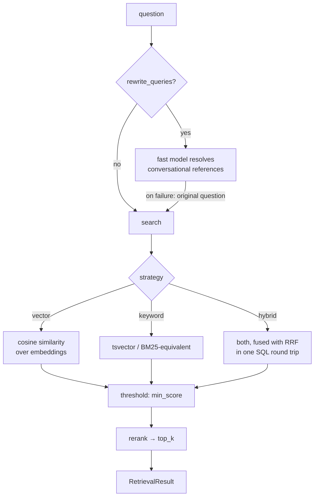

# Retrieval

*How a question becomes five passages. The stage that bounds everything downstream.*

---

## Why retrieval is the whole game

Generation cannot recover from a passage that was never fetched. If the answer to a
question is in chunk 47 and retrieval returns chunks 12, 19, 88, 91 and 103, then no
model — however good, however expensive — can answer it correctly. It can only decline,
or invent.

That is why `recall@k` is the headline metric in [evaluation.md](evaluation.md), and
why the retrieval pipeline gets six explicit, individually-instrumented stages rather
than being compressed into a clever one-liner.

---

## The pipeline



Six stages, each a timed span carrying attributes that describe how the data changed —
counts, ids, scores. The trace answers "why did the model see *these five* passages?"
without a debugger.

---

## Hybrid search, and why it is the default

Two retrieval methods with complementary blind spots:

**Vector search** embeds the query and finds chunks whose embeddings are nearest by
cosine similarity. It handles paraphrase well — "how do I stop customers seeing the
full price?" finds a passage about cart page display without sharing a word with it. It
handles *exact tokens* badly: acronyms, error strings, product codenames and tags like
`oscp-order-processing` have no meaningful semantic neighbourhood, and an embedding
model will happily place a made-up identifier next to a real one.

**Keyword search** (PostgreSQL's `tsvector`, a BM25-equivalent ranking) is exactly the
reverse. It finds `oscp-order-processing` immediately and misses every paraphrase.

An internal corpus is dense with both. OSC's is a product FAQ full of feature names,
Shopify admin paths and CSS selectors — *and* full of merchants asking questions in
their own words. Choosing one method means accepting a known failure mode on half the
corpus.

**This is avoiding a known failure mode, not premature optimisation.** The distinction
matters because the project's own rules forbid the latter.

### Reciprocal Rank Fusion

Two ranked lists with incomparable scores — a cosine similarity in [-1, 1] and a
`ts_rank` on an unbounded scale — cannot be merged by score. RRF merges by *rank*:

$$\text{RRF}(d) = \sum_{r \in \text{rankings}} \frac{1}{k + \text{rank}_r(d)}$$

with `k = 60` (`rrf_k`), the value from the original paper. A document ranked highly by
either method scores well; a document ranked highly by *both* scores best. No
score normalisation, no tuned weight between the two methods, nothing to calibrate when
the embedding model changes.

> Cormack, Clarke & Buettcher, *Reciprocal Rank Fusion outperforms Condorcet and
> individual Rank Learning Methods* (SIGIR 2009).
> https://dl.acm.org/doi/10.1145/1571941.1572114

**The pgvector store implements this formula in SQL, in one round trip.** `fusion.py`
holds the reference implementation in Python; the memory store uses it directly. Both
stores therefore rank identically, which is what makes the in-memory store a legitimate
test double for ranking behaviour rather than only for plumbing.

This is also the specific reason LangChain's `PGVector` was not adopted: it does not
fuse in SQL, so hybrid retrieval would have become two round trips and a merge in
application code.

---

## Thresholding before reranking

```python
kept = [hit for hit in candidates if hit.score >= min_score]
selected = await reranker.rerank(query, kept, top_k)
```

`min_score` is applied to **first-stage** scores, and the ordering is deliberate.

Only first-stage scores are on a known scale — a cosine similarity, or an RRF score. A
cross-encoder returns an unbounded logit that is routinely *negative* for a genuinely
relevant passage. Thresholding its output at the same configured value would discard
the entire result set the moment a reranker was enabled, and would present as "the
cross-encoder is useless" rather than as a misapplied threshold.

This was a real defect, found and fixed, and `test_retrieval.py` carries the
regression.

---

## Reranking

`noop` by default. `cross_encoder` is registered, tested, and one config line away.

A cross-encoder scores *(query, passage)* pairs jointly rather than comparing
independent embeddings, which is strictly more informative and strictly more expensive
— it is a model call per candidate rather than a vector comparison. Typical published
gains are real but corpus-dependent.

It is off because **its value on OSC's corpus has never been measured**, and the
project's rule is that a retrieval change ships with a measured improvement. Turning it
on is now a two-command experiment:

```bash
./osc eval --retrieval-only -o evaluation/results/noop.json
OSC_RERANKER__PROVIDER=cross_encoder ./osc eval --retrieval-only \
  --baseline evaluation/results/noop.json
```

That comparison is a recommended next milestone precisely because it is now cheap.

---

## Query rewriting

**On by default since Phase 6, on a measurement.** It resolves conversational
references — "what about the second one?" — into a standalone query using the
configured `fast_llm`.

It is best-effort by construction: any failure falls back to the original question and
records why on the span. A rewriting stage that can fail a request would be a
liability, since it is an optimisation.

**This is the only path by which conversation history reaches retrieval.** With it
off, a follow-up is *generated* with full context and *retrieved for* as if it were
standalone — "what type is it?" searches the index for those literal words. That is
not a theory: the conversational suite runs every context-dependent turn twice, once
in the session and once cold, and the pair says so directly.

|  | off | on |
|---|---|---|
| `follow_up_resolution` | 0.765 | **0.941** |
| `follow_up_resolution_no_context` (cold control) | 0.765 | 0.765 |
| `follow_up_lift` | **0.000** | **+0.177** |
| `context_pollution` | 0.000 | 0.000 |

A lift of exactly zero with it off is the whole argument. Turning it on resolves three
more of the seventeen context-dependent turns and does not drag standalone questions
back toward the previous topic.

Single-turn quality is unaffected **by construction** — with no history the rewriter
returns the question untouched and makes no model call — and that was confirmed rather
than assumed: `recall@5`, `mrr`, `ndcg@5` and `precision@5` on the schema suite are
bit-identical with it on and off.

The cost is one `fast_llm` call per follow-up turn, on the critical path. It was off
through Phase 5 because there was nothing to rewrite *from*: no session memory existed
and the bundled UI sent no history. Both landed in Phase 6 (ADR 0013).

---

## Configuration and what each knob does

```yaml
retrieval:
  strategy: hybrid      # vector | keyword | hybrid
  candidates: 30        # fetched from the store before thresholding and reranking
  top_k: 5              # passed to the model as sources
  rrf_k: 60             # RRF constant
  min_score: 0.0        # applied to first-stage scores
  rewrite_queries: true   # the only path by which history reaches retrieval
```

`candidates` is the reranker's working set: with `noop` it only needs to exceed
`top_k`, but with a cross-encoder it is the recall ceiling the reranker can reorder
within. `top_k` is bounded by the model's context. Note that since the chunker changed
(ADR 0012) the median chunk is 278 characters rather than 826, so five chunks is now
roughly a third of the context it used to be — **`top_k` has not been re-tuned, and
that is the most clearly-owed experiment in this file.**

**Every one of these values is currently an educated guess.** That is what the
evaluation harness exists to change.

---

## Measured baseline

Default local profile, 55 scored cases, `docs/company/schema` corpus, `markdown`
chunking:

| Metric | Value |
|---|---|
| `recall@5` | **0.982** |
| `hit_rate@5` | **0.982** |
| `ndcg@5` | **0.918** |
| `mrr` | **0.897** |
| `precision@5` | 0.200 |

From `evaluation/baselines/schema-retrieval.json`. `precision@5` is at its
**structural maximum**: most cases have exactly one relevant document out of five
slots, so the ceiling *is* 0.2 and the observed value is a perfect score. It is useful
as a *relative* measure across runs and misleading as an absolute one — this is the
metric in the report most likely to be misread.

The single case that misses is informative rather than embarrassing.
`bulk-variant-rules-key` asks where quantity-break tier rules live; `oscp.priceRule`
is described in both `schema-2.md` and `schema-6.md`, and the golden set names one.
That is a curation finding, and the kind of thing the harness exists to surface.

The Phase 5 figures over the FAQ corpus (`recall@5` 0.932, `mrr` 0.860) are preserved
in `evaluation/baselines/faq-retrieval.json`. **They are not comparable to the above**
— different corpus, different questions.

---

## Related

- [chunking-and-embeddings.md](chunking-and-embeddings.md) — what is being retrieved over
- [evaluation.md](evaluation.md) — how any of this is judged
- [../technologies/postgresql-pgvector.md](../technologies/postgresql-pgvector.md) — the SQL behind it
- [ADR 0003](../decisions/0003-hybrid-retrieval.md) — the decision record
