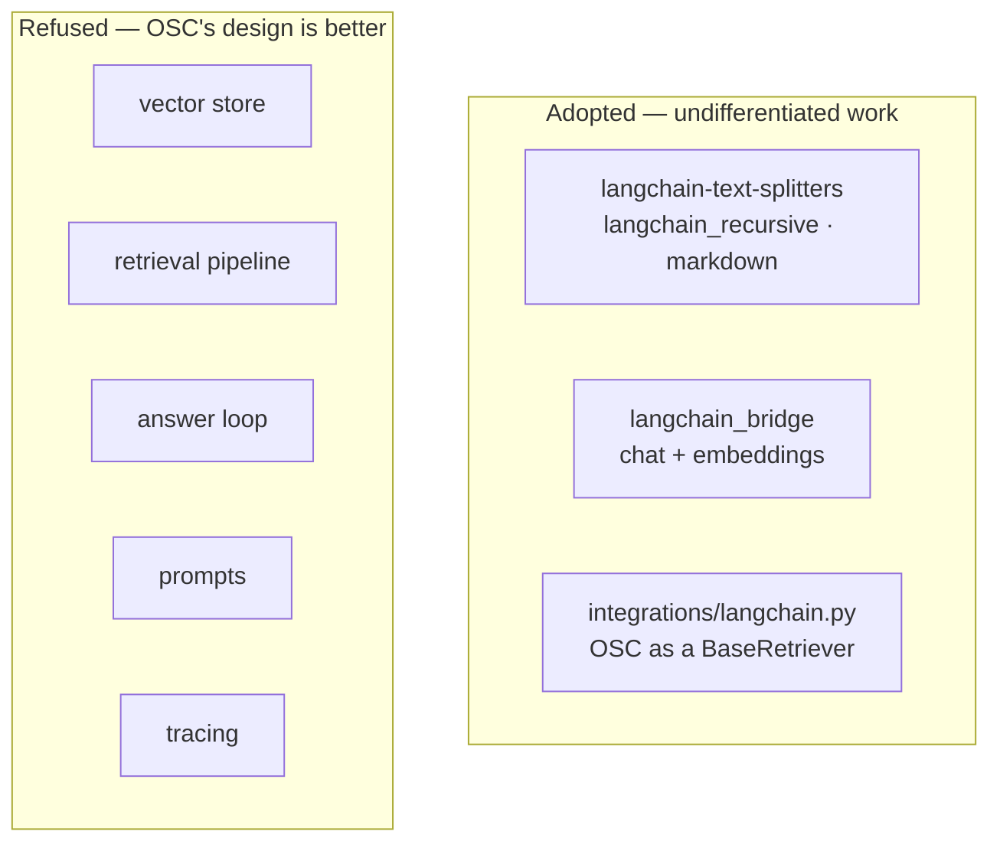

# LangChain

*The most contested dependency in the project. Rejected once, then partially adopted —
and the reversal is worth recording honestly.*

---

## What it is

A framework for building LLM applications: document loaders, text splitters, vector
store wrappers, prompt templates, chains (LCEL), agents, and integration packages for
essentially every model provider in existence.

https://python.langchain.com/docs/

---

## The rule that decided it

> **Adopt LangChain for undifferentiated work. Keep OSC's own code where OSC's design
> is better.**

Requirement 7 of the original architecture asked for a pragmatic evaluation — adopt if
it genuinely improves the architecture, reject if not, on evidence rather than
ideology. Iteration 1 rejected it outright. Iteration 2 revised that.

**The original rejection was right about the framework and wrong about the libraries.**
The stated reason — *"a framework would impose its own document and retriever
abstractions on top of ours, add a large transitive dependency tree, and place an
uncontrolled layer on the exact code path that most needs tracing and tuning"* — is
still true, and is still why LangChain does not own the retrieval pipeline, the vector
store, the prompts or the answer loop.

What the original assessment treated as *one* decision was actually several, and two of
the smaller ones deserved a different answer.

---

## What was adopted



### Text splitting

`chunking/langchain_splitters.py` supplies `langchain_recursive` and `markdown`.

Splitting text on the coarsest boundary that fits is a genuinely generic problem. OSC's
own implementation carried known rough edges — a chunk can exceed its budget by up to
the overlap, and the overlap slice can cut mid-word — and heading-aware splitting would
otherwise have to be written and maintained here.

Chunk ids come from the same shared helper the built-in chunkers use, so idempotent
ingestion behaves identically whichever strategy is configured.

### Provider reach

`providers/{llm,embeddings}/langchain_bridge.py`. One adapter wraps any LangChain
`BaseChatModel` or `Embeddings` behind OSC's protocols, making Bedrock, Vertex, Azure,
Cohere, Mistral, Fireworks and the rest reachable **by configuration rather than by
writing an adapter each time**.

This creates the deliberate [two-tier provider
strategy](../architecture/provider-architecture.md#the-two-tier-provider-strategy):
native adapters are the default path and keep provider-specific capabilities; the
bridge covers the long tail at the cost of marker-parsed citations and one more layer.

The class is named by import path in `options.class_path` rather than resolved by
`init_chat_model`, which lives in the `langchain` meta-package and would pull LangGraph
in to save one line of configuration.

### Outbound interoperability

`integrations/langchain.py` presents OSC's retrieval pipeline as a LangChain
`BaseRetriever`.

The reasoning is organisational rather than technical. OSC's value is the indexed
corpus and how it is retrieved, not the answer loop — and teams inside the company will
build agents on frameworks OSC does not control. Making the retriever consumable means
they use the same index and the same tuning, rather than standing up a parallel index
that drifts.

**The dependency direction is enforced:** `integrations/` may import from the core, and
the core may never import from `integrations/`. That one-way edge is what stops an
outbound adapter from becoming a dependency of the platform.

---

## What was refused, and why

| Component | Why OSC's own is better |
|---|---|
| **Vector store** | The pgvector store fuses lexical and vector search with RRF **in SQL**, in one round trip. LangChain's `PGVector` does not, so hybrid retrieval would become two queries and a merge in application code |
| **Retrieval pipeline** | Six explicit stages, each instrumented and independently testable. LCEL would obscure the exact path most in need of reading |
| **Answer loop** | Abstention, the citation policy and the streaming contract are the parts most specific to OSC's requirements — the parts where a generic implementation is a liability |
| **Prompts** | Frozen module constants, precisely so the prefix stays byte-identical for caching and for attributable evaluation. A template engine has nothing to add to a constant |
| **Tracing** | LangChain callbacks observe LangChain runs; most of this pipeline is not one. A tracer built on them would be blind to chunking, SQL fusion and the abstention decision |
| **Document type** | `langchain_core.Document` appears at the boundary only. Domain types stay frozen dataclasses with no framework in them |

The pattern in that table: LangChain was refused wherever the component is either
**the thing OSC is actually good at** or **the thing that most needs to be readable**.

---

## Dependency posture

`langchain-core` and `langchain-text-splitters` are **core** dependencies, and the
distinction is the point: both are pure Python with no vendor SDK behind them, and both
must be importable for the registries to be complete.

Every LangChain *integration* package (`langchain-anthropic`, `langchain-aws`, …)
remains an install-time choice named by the operator in `options.class_path`. This
preserves the existing principle — **the core runtime is small, vendor SDKs are
extras.**

Verified versions: `langchain-core` 1.5.3, `langchain-text-splitters` 1.1.2.
`./osc doctor` reports both.

---

## Trade-offs accepted

- **Two ways to reach a provider.** A native adapter and a bridge, with different
  citation quality. Documented, and the reason `supports_citations` is on the protocol.
- **A framework's release cadence.** LangChain moves fast and has broken APIs across
  major versions. Constrained to `>=1.0` and confined to two packages, which limits the
  blast radius.
- **The chunkers are registered but unmeasured.** They cost no code to maintain, but
  "available" is not "better". See below.

---

## Future evolution

**The chunker comparison is the open item.** The default is still `recursive` despite
`langchain_recursive` having strictly better edge cases, because switching changes every
chunk id in a live index and the project's rule is that a retrieval change ships with a
measured improvement.

There was no way to measure one until this iteration. There is now:

```bash
./osc eval --retrieval-only -o evaluation/results/recursive.json
./osc ingest ./docs/company --reindex --profile config/experiments/markdown.yaml
./osc eval --retrieval-only --profile config/experiments/markdown.yaml \
  --baseline evaluation/results/recursive.json
```

Whichever wins becomes the default. That is a Milestone A success criterion, and the
single highest-value use of the harness on day one.

---

## Related

- [ADR 0002](../decisions/0002-langchain-scope.md) — the decision record, including the reversal
- [../architecture/provider-architecture.md](../architecture/provider-architecture.md)
