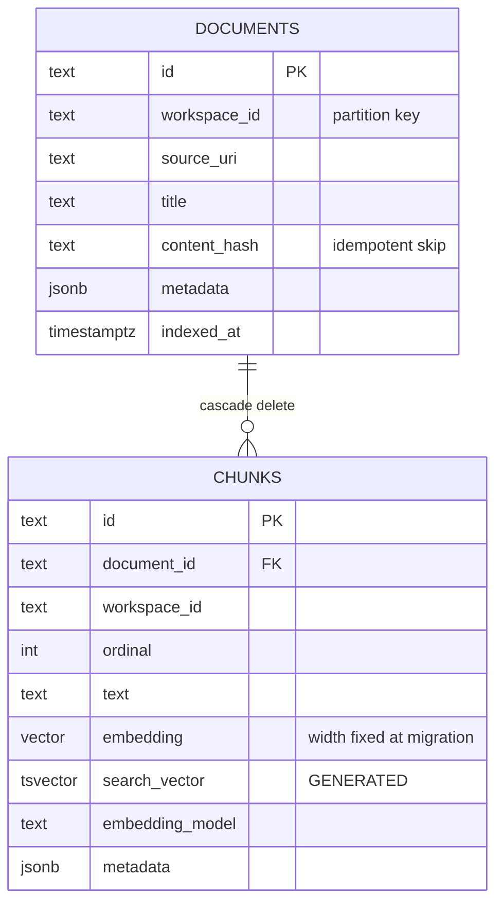

# PostgreSQL + pgvector

---

## What it is

**PostgreSQL** is a relational database. **pgvector** is a PostgreSQL extension adding
a `vector` column type, distance operators (`<=>` cosine, `<->` L2, `<#>` inner
product) and approximate-nearest-neighbour indexes (IVFFlat and HNSW).

- PostgreSQL: https://www.postgresql.org/docs/current/
- pgvector: https://github.com/pgvector/pgvector
- Full-text search: https://www.postgresql.org/docs/current/textsearch.html

---

## Why OSC uses it

**One datastore holds everything.** Chunk text, embeddings, the lexical index (a
generated `tsvector` column) and document metadata live in one database. Three
consequences:

1. **A chunk and its vector cannot drift apart.** With a separate vector database, an
   ingestion that half-succeeds leaves a vector pointing at text that no longer exists —
   and nothing detects it until a user gets a citation to a deleted passage.
2. **There is one backup.** Not two systems with two retention policies and a
   consistency assumption between them.
3. **Hybrid retrieval is one round trip.** Both rankings are computed and fused in a
   single SQL statement. This is the specific technical reason LangChain's `PGVector`
   was not adopted: it does not fuse in SQL, so hybrid search would have become two
   queries and a merge in application code.

**It is boring.** Every team knows how to back it up, monitor it, and restore it at
3am. A dedicated vector database is one more thing to operate, and at OSC's corpus size
it would buy nothing.

---

## Where it is used

`src/osc_assistant/providers/vectorstores/pgvector.py` — the only module that speaks
SQL. `migrations/001_init.sql` holds the schema, applied by a forward-only runner in
the same file.

---

## How it integrates

**The dimension is substituted into the DDL at migration time**, from the configured
embedding model. This is why changing the embedding model requires a new database and a
full re-index — the column is typed `vector(768)`, not `vector`.

**The HNSW index is created only when the dimension is ≤ 2000**, which is pgvector's
limit. Above it, search degrades to an exact scan; the migration reports which path it
took rather than failing.

**`search_vector` is a generated column**, so the lexical index cannot fall out of sync
with the text. There is no application code that could forget to update it.

**Every table carries `workspace_id`.** The only speculative design in the codebase,
defended on one ground: adding a partition key to a populated corpus is a data
migration, and not adding it is a column.

**Hybrid search fuses in SQL.** Two CTEs — one ranking by `embedding <=> $query`, one
by `ts_rank` — joined and scored by the RRF formula, ordered, limited. `fusion.py`
holds the same formula in Python for the memory store, so **both stores rank
identically** and the in-memory store is a legitimate test double for ranking, not just
for plumbing.

**Vendor exceptions never escape.** `asyncpg` errors are translated into
`VectorStoreError` at the adapter boundary, with the DSN password redacted. Untranslated
they surfaced as a bare `OSError` traceback in the CLI *and bypassed the API's error
handler entirely* — the most common operational failure was also the worst reported.

---

## Alternatives considered

| Option | Why not |
|---|---|
| **Pinecone / Weaviate / Qdrant** | A second system to operate, a second backup, a second place for state to diverge. Real advantages at hundreds of millions of vectors; OSC has thousands |
| **Elasticsearch / OpenSearch** | Excellent hybrid search, and a heavy JVM operational footprint for a corpus that fits in a laptop's page cache |
| **FAISS** | A library, not a database — no persistence, no metadata, no transactions. It is the right answer inside a vector database, not instead of one |
| **SQLite + sqlite-vec** | Genuinely attractive for a single-node deployment and has no concurrent-writer story. Postgres was already the ingestion target |
| **IVFFlat instead of HNSW** | Faster to build, needs training data proportional to the corpus, and worse recall at the same latency. HNSW's build cost is paid once at index time |

`VectorStore` is a protocol precisely so that any of these remains a new file rather
than a rewrite.

---

## Trade-offs accepted

- **Approximate search.** HNSW trades exactness for speed. At this corpus size the
  recall loss is not measurable; at scale, `ef_search` is the knob.
- **The dimension is baked into the schema.** A loud failure at migration time in
  exchange for no silent nonsense at query time. Correct trade, real cost.
- **One database is one failure domain.** When Postgres is down, everything is down.
  This is precisely why the [trace log is a file](../architecture/observability.md) and
  not a table: the debugging tool must survive the thing it debugs.
- **Ingestion assumes a single writer.** `_prune` reads the document-hash map at the
  start of a sync and deletes anything absent at the end. Two concurrent ingestions
  would fight.

---

## Future evolution

- **Pin the image digest.** `docker-compose.yml` uses `pgvector/pgvector:pg16`, a moving
  tag.
- **Give the integration suite its own database.** The e2e suite already does this; the
  pgvector suite writes to the application database, isolated only by `workspace_id`.
- **ACL predicates.** Per-document access control is designed to be a SQL predicate at
  query time so an unauthorised chunk is never retrieved — a `WHERE` clause on a column
  that does not exist yet.
- **Partitioning by `workspace_id`** if multi-tenancy becomes real. The key is already
  on every table, which is the whole reason it was added.

---

## Reference environment

PostgreSQL 18.4 with pgvector 0.8.2, verified. `docker-compose.yml` covers the
development database only — there is no service image yet.
